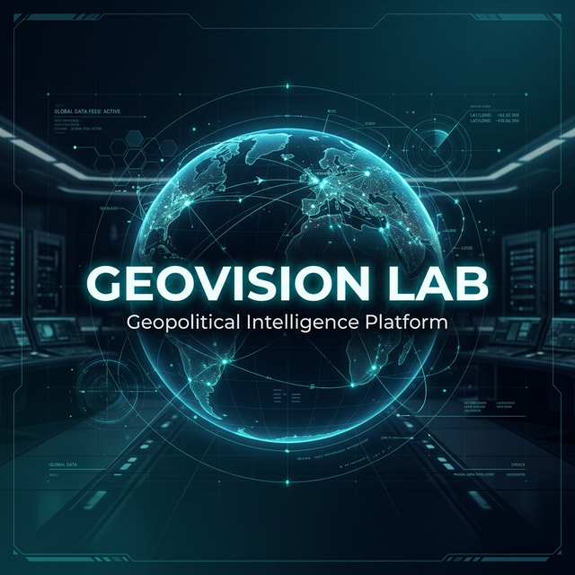
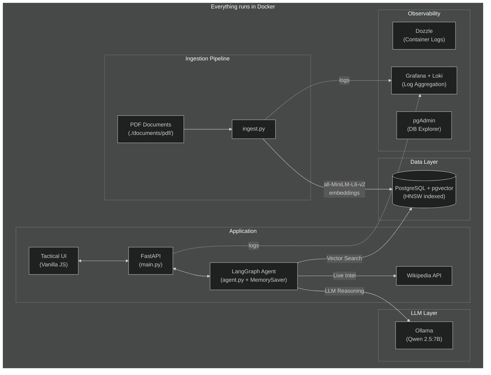

<p align="center">
  
</p>

<h1 align="center">GeoVision Lab</h1>

<p align="center">
  <em>Autonomous Geopolitical Intelligence Platform — fully containerized, privacy-first</em>
</p>

<p align="center">
  <strong>📝 This is a demo / learning project</strong>
</p>

---

## What is this?

GeoVision Lab is a local-first RAG (Retrieval-Augmented Generation) platform for geopolitical analysis. It ingests PDF documents, vectorizes them, and lets you query them through an AI-powered chat interface — all running inside Docker with zero cloud dependencies.

### Key Features

- **Fully Dockerized** — one `docker compose up --build` and everything runs. No local installs needed.
- **Hybrid RAG Pipeline** — combines a local vector database (archival intelligence) with live sources (Wikipedia) for comprehensive answers.
- **Conversational Memory** — the agent remembers context within a session, so you can ask follow-up questions naturally.
- **HNSW Vector Index** — approximate nearest neighbor search for fast retrieval, even with large document collections.
- **Built-in Monitoring** — Grafana + Loki for log aggregation, Dozzle for real-time container logs, pgAdmin for database inspection.

---

## Architecture



---

## Quick Start

### Prerequisites

- **Docker** and **Docker Compose** — that's it. Everything else runs inside containers.

#### GPU Acceleration (optional)

The Ollama LLM service can use an NVIDIA GPU for significantly faster inference. Without a GPU, the stack still works — it just runs in CPU-only mode.

To enable GPU acceleration:

1. Install [NVIDIA drivers](https://www.nvidia.com/Download/index.aspx) for your GPU
2. Install the [NVIDIA Container Toolkit](https://docs.nvidia.com/datacenter/cloud-native/container-toolkit/latest/install-guide.html)
3. Verify your setup:

```bash
# Host GPU visible?
nvidia-smi

# GPU accessible inside Docker?
docker run --rm --gpus all nvidia/cuda:12.0-base nvidia-smi
```

Once configured, `docker compose up --build` will automatically pass the GPU through to the Ollama container. You can confirm GPU detection in the Ollama logs:

```bash
docker logs geovision-ollama 2>&1 | grep -i "gpu\|cuda\|nvidia"
```

### 1. Add your documents

Place PDF files in the `./documents/pdf/` directory. These are your source documents for the RAG pipeline.

### 2. Launch

```bash
docker compose up --build
```

This will:
1. Start **PostgreSQL** (with pgvector extension)
2. Start **Ollama** and pull the Qwen 2.5:7B model (first run takes a while)
3. Run the **ingestion pipeline** — loads your PDFs, chunks them, generates embeddings, and stores them in the vector database
4. Run **database migrations** (Alembic) — creates the HNSW index for fast vector search
5. Start the **FastAPI application** with the chat UI
6. Start all **monitoring services**

### 3. Open the dashboards

| Service | URL | Description |
|---------|-----|-------------|
| **Intelligence Terminal** | [localhost:8000](http://localhost:8000) | Main chat interface for querying the agent |
| **Container Logs (Dozzle)** | [localhost:9999](http://localhost:9999) | Real-time per-container log viewer |
| **Grafana** | [localhost:3000](http://localhost:3000) | Log aggregation dashboard (admin / geovision) |
| **pgAdmin** | [localhost:8082](http://localhost:8082) | Database explorer (admin@geovision.lab / geovision) |

---

## Project Structure

```text
.
├── static/                # Frontend UI
│   └── index.html
├── agent.py               # LangGraph agent + conversational memory
├── main.py                # FastAPI backend & /chat endpoint
├── ingest.py              # PDF ingestion pipeline
├── docker-compose.yml     # Full stack definition (all services)
├── Dockerfile             # Python app container
├── requirements.txt       # Python dependencies
├── alembic.ini            # Alembic migration config
├── migrations/            # Database migrations
│   ├── env.py
│   ├── script.py.mako
│   └── versions/
│       └── 001_add_hnsw_index.py
├── documents/             # Your source documents
│   └── pdf/               # Place PDFs here
└── monitoring/            # Observability configs
    ├── promtail-config.yaml
    ├── grafana-datasources.yaml
    ├── pgadmin-servers.json
    └── pgpass
```

---

## Tech Stack

| Component | Technology | Purpose |
|-----------|-----------|---------|
| LLM | Ollama + Qwen 2.5:7B | Local language model inference |
| Embeddings | all-MiniLM-L6-v2 (HuggingFace) | Document vectorization (384 dim) |
| Vector DB | PostgreSQL + pgvector + HNSW | Vector storage and similarity search |
| Agent Framework | LangGraph + MemorySaver | Autonomous reasoning with conversational memory |
| Backend | FastAPI | REST API and static file serving |
| Frontend | Vanilla JS/CSS | Dark tactical terminal UI |
| Monitoring | Grafana, Loki, Promtail, Dozzle | Logs, metrics, real-time container views |
| DB Admin | pgAdmin | Database inspection and management |

---

## Database Migrations (Alembic)

This project uses [Alembic](https://alembic.sqlalchemy.org/) for database schema management. Think of it as **version control for your database** — each migration describes a schema change, and Alembic tracks which ones have already been applied.

### How it works

- On startup, the app container runs `alembic upgrade head` **before** starting the server. Pending migrations are applied automatically.
- Applied migrations are tracked in the `alembic_version` table, so they never run twice.
- Each migration has an `upgrade()` and `downgrade()` function for applying and reverting changes.

### Common commands

Run these inside the app container (`docker compose exec app sh`):

```bash
# Apply all pending migrations
alembic upgrade head

# Revert the last migration
alembic downgrade -1

# Show current migration
alembic current

# Show migration history
alembic history
```

### Creating a new migration

```bash
# Generate a new migration script
alembic revision -m "describe your change here"
```

This creates a file in `migrations/versions/`. Edit the `upgrade()` and `downgrade()` functions, then restart the app or run `alembic upgrade head`.

---

## Agent Workflow

The GeoVision Agent uses **LangGraph** to autonomously decide how to answer queries:

1. **Triage** — evaluates whether the question needs historical archives, live data, or both
2. **Vector Search** — retrieves relevant document chunks from PostgreSQL using HNSW-accelerated similarity search
3. **Web Search** — queries Wikipedia for current events and background information
4. **Synthesis** — the local LLM combines all sources into a structured intelligence assessment
5. **Memory** — maintains conversational context within a session via `MemorySaver`, enabling follow-up questions

All inference runs locally inside Docker. No data leaves your machine.
