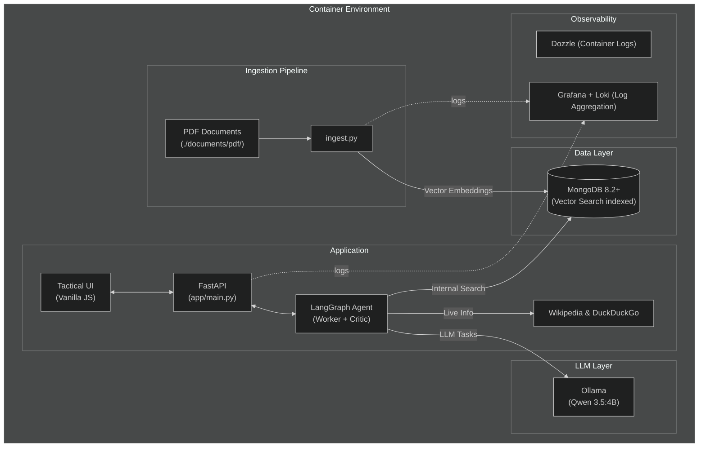

<h1 align="center">GeoVision Lab</h1>

<p align="center">
  <em>Autonomous Geopolitical Intelligence Platform — fully containerized, privacy-first</em>
</p>

<p align="center">
  <strong>📝 This is a demo / learning project</strong>
</p>

<p align="center">
  
</p>

<p align="center">
  <strong>Interactive Tactical Maps (Leaflet.js) automatically rendering points and full country borders</strong>
</p>

---

## Overview

GeoVision Lab is a local-first RAG (Retrieval-Augmented Generation) platform for geopolitical intelligence analysis. It ingests documents (PDF, Markdown), vectorizes them using semantic embeddings, and lets you query them through an AI-powered chat interface — all running entirely within Docker without cloud dependencies.

**Test Data Included**: The platform ships with sample fantasy lore about the **DuckyDucks and FrogyFrogs** of Quackswamp — a rich test dataset for validating vector search capabilities.

### Tech Stack & Architecture

GeoVision Lab utilizes a hybrid RAG approach, maintaining conversational memory to allow for natural follow-up questions. It autonomously leverages local and web search tools depending on whether queries target historical archives or unfolding live events. All inference runs locally inside Docker. No data leaves your machine.

| Component | Technology | Purpose |
|-----------|-----------|---------|
| **Primary LLM** | Ollama + Qwen 3.5 (switchable: 9B, 4B, 0.8B) | Core analysis, reasoning, and response generation |
| **QA/Review LLM** | Ollama + Qwen 2.5:0.5b | Dedicated "Critic" agent checking map constraints before output |
| **Embeddings** | all-MiniLM-L6-v2 | Document vectorization for semantic search |
| **Vector DB** | MongoDB 8.2+ Vector Search | Document storage with native vector search using mongot |
| **Database GUI** | Mongo Express | Web interface to browse and manage MongoDB |
| **Agent Framework** | LangGraph + MemorySaver | Multi-agent coordination, web/vector search routing, and conversation memory |
| **Frontend UI** | Vanilla JS, Leaflet.js | Cyber/Tactical terminal with robust markdown streaming, dynamic map rendering, model switching, and font optimizations (`Rajdhani`) |
| **Testing/CI** | PyTest, Testcontainers, GitHub Actions | Full end-to-end integration tests & automated linter quality gates |
| **Monitoring** | Grafana, Loki, Dozzle | Log aggregation, metrics, and real-time container log viewing |



---

## Technology Choices & Rationale

### Why MongoDB for Vector Search?

We migrated from PostgreSQL/pgvector to **MongoDB 8.2+ Vector Search** for several compelling reasons:

| Factor | PostgreSQL + pgvector | MongoDB 8.2+ Vector Search |
|--------|----------------------|---------------------------|
| **Setup Complexity** | Requires extension installation, HNSW index tuning | Native vector search with automatic index management |
| **Schema Flexibility** | Rigid schema, migrations needed for changes | Document-based, schemaless design |
| **Horizontal Scaling** | Complex sharding setup | Built-in sharding and replica sets |
| **Developer Experience** | SQL-based, requires ORM layer | JSON-native, intuitive for JavaScript/Python developers |
| **Vector Search Performance** | Good with HNSW, but requires manual tuning | Optimized `mongot` service with automatic candidate selection |
| **Cloud-Native** | Traditional RDBMS architecture | Designed for distributed, cloud-native deployments |

**Key Decision Factors:**
1. **Simplified Operations**: MongoDB's vector search is built-in and managed through the same interface as regular queries
2. **No Migration Overhead**: Document structure adapts naturally to varying document lengths and metadata
3. **Future-Proof**: MongoDB's rapid iteration on AI/ML features ensures continued improvements
4. **Unified Data Model**: Store structured metadata alongside vectors without complex joins

### Why Ollama for LLM Inference?

**Ollama** was chosen as our LLM runtime for these reasons:

1. **Local-First Philosophy**: Complete offline operation with no API keys or cloud dependencies
2. **Model Flexibility**: Easy switching between models (Qwen 3.5 9B/4B/0.8B) without code changes
3. **Resource Efficiency**: Automatic GPU acceleration with fallback to CPU
4. **Simple Deployment**: Single container with built-in model management
5. **Open Source**: Full transparency and control over the inference stack

### Why LangGraph for Agent Architecture?

**LangGraph** provides the orchestration layer for our multi-agent system:

1. **Stateful Execution**: Built-in conversation memory through `MemorySaver`
2. **Graph-Based Flow**: Visual, predictable agent behavior with explicit state transitions
3. **Tool Integration**: Seamless binding of custom tools (vector search, web search)
4. **Human-in-the-Loop**: Support for review/approval steps (our QA Reviewer agent)
5. **Streaming Support**: Real-time token streaming for responsive UX

### Why all-MiniLM-L6-v2 for Embeddings?

The **sentence-transformers/all-MiniLM-L6-v2** model offers:

1. **Compact Size**: 384 dimensions vs. 768+ for larger models
2. **Speed**: Fast embedding generation (~2800 tokens/second)
3. **Quality**: Strong semantic understanding for RAG applications
4. **Local Execution**: No API calls, runs entirely within Docker
5. **Proven Track Record**: Widely adopted in production RAG systems

### Why Vanilla JS + Leaflet for Frontend?

1. **Zero Build Step**: No webpack, Vite, or npm complexity
2. **Lightweight**: ~50KB total vs. MBs for React/Vue bundles
3. **Leaflet Integration**: Best-in-class open-source mapping library
4. **Direct DOM Control**: Precise control over streaming updates
5. **Educational Value**: Clear, readable code for learning purposes

### Why Grafana + Loki for Observability?

1. **Log Aggregation**: Centralized logging across all containers
2. **Real-Time Debugging**: Live tailing of container logs via Dozzle
3. **Cost-Effective**: Open-source alternative to Datadog/Splunk
4. **Query Language**: LogQL enables powerful log analysis
5. **Visual Dashboards**: Grafana provides professional visualization

---

## Quick Start

### LLM Model Switching

GeoVision Lab now supports **dynamic switching between different Qwen 3.5 LLM models** for reasoning tasks:

| Model | Size | Speed | Quality | Use Case |
|-------|------|-------|---------|----------|
| **Qwen 3.5 9B** | 9 billion | Slower | Highest | Complex analysis, detailed reports |
| **Qwen 3.5 4B** | 4 billion | Balanced | High | Default - general purpose queries |
| **Qwen 3.5 0.8B** | 0.8 billion | Fastest | Basic | Quick lookups, simple queries |

**To switch models:**
1. Open the Tactical UI at [localhost:8000](http://localhost:8000)
2. Use the model selector dropdown located just above the chat input field
3. Select your desired model - the change takes effect immediately (and you will see the model indicator update near the footer)

**Note:** The QA/Reviewer model remains fixed at Qwen 2.5:0.5b for consistent constraint checking.

### Prerequisites

- **Docker** and **Docker Compose**

#### GPU Acceleration (optional but recommended)

You can run the stack in CPU-only mode, but an NVIDIA GPU vastly accelerates LLM inference in the Ollama container.

1. Ensure NVIDIA drivers are installed.
2. Install the **NVIDIA Container Toolkit** for your OS ([Installation Guide](https://docs.nvidia.com/datacenter/cloud-native/container-toolkit/latest/install-guide.html)).
3. Configure Docker to use the NVIDIA runtime:
   ```bash
   sudo nvidia-ctk runtime configure --runtime=docker
   sudo systemctl restart docker
   ```
4. Check visibility:
   ```bash
   docker run --rm --gpus all nvidia/cuda:12.0-base nvidia-smi
   ```

### 1. Add your documents

Place PDF files into the `./documents/pdf/` directory. These are your source materials for the RAG archival pipeline.

### 2. Launch the Stack

```bash
docker compose up --build
```

This command seamlessly orchestrates the MongoDB database with vector search, pulls the LLM, chunks and ingests your documents, creates the vector search index, boots the core web application, and starts all observability tooling.

### 3. Open the Dashboards

Once everything is running, access the services:

| Service | Access | Default Credentials |
|---------|-----|-------------|
| **Intelligence Terminal** | [localhost:8000](http://localhost:8000) | - |
| **MongoDB Browser** | [localhost:8081](http://localhost:8081) | `admin` / `geovision` |
| **Container Logs (Dozzle)** | [localhost:9999](http://localhost:9999) | - |
| **Grafana Logs** | [localhost:3000](http://localhost:3000) | `admin` / `geovision` |

---

## Testing & Validation

### Quick Test with Included Fantasy Data

The platform includes a sample document (`documents/fantasy.md`) about the **DuckyDucks and FrogyFrogs** of Quackswamp. Use these test queries to validate the system:

| Test Query | Expected Behavior |
|------------|-------------------|
| *"Where is the secret base of the DuckyDucks located?"* | Should retrieve Antarctica reference from the document |
| *"Tell me about the War of Ripples"* | Should return details about the 6-year war (1247-1253) |
| *"What are the characteristics of FrogyFrogs?"* | Should list emerald skin, leaping ability, water magic |
| *"Who signed the Treaty of Ripples?"* | Should mention the peace treaty signed on a lily pad |
| *"What is the Prophecy of the Golden Tadpole?"* | Should retrieve the prophecy about DuckyDuck-FrogyFrog unity |

### Full Validation Checklist

1. **Ingestion Verification**: Run `docker compose up --build` and check the Dozzle logs for `geovision-ingest` to confirm document loading and chunking.

2. **Archival Vector Search**: In the Terminal UI at [localhost:8000](http://localhost:8000), ask a query about the DuckyDucks or FrogyFrogs. Watch the trail steps to see the `vector_search` tool triggered.

3. **Live Open-Source Intel**: Ask about a current breaking news topic to verify `duckduckgo_search` tool execution.

4. **Time Awareness**: Ask "What exact date and time is it right now?" to see dynamic context injection.

5. **Map Rendering**: Ask "Show me Lake Featherside" to verify the map tag parsing and Leaflet rendering.

6. **Model Switching**: Use the model selector to switch between Qwen 3.5 variants and observe response quality/speed differences.

---

## Project Structure

```text
.
├── app/                   # Root application package
│   ├── agents/            #   LangGraph architecture & search tools
│   ├── api/routes/        #   FastAPI REST endpoints
│   ├── core/              #   Global settings
│   ├── ingestion/         #   RAG data processing pipeline
│   └── services/          #   LLM integration & MongoDB vector store connectors
├── static/                # Vanilla JS / CSS Tactical UI
├── documents/
│   ├── pdf/               # Local stash for your source PDFs
│   └── fantasy.md         # Sample test data (DuckyDucks & FrogyFrogs)
├── monitoring/            # Configuration for Loki, Promtail, Grafana
├── docs/                  # Additional documentation
├── docker-compose.yml
├── Dockerfile
└── requirements.txt
```

---

## Additional Documentation

- [**Agent Graph & Tool Calling Logic**](learnings.md)
- [**Debugging Guide**](docs/debugging.md)
