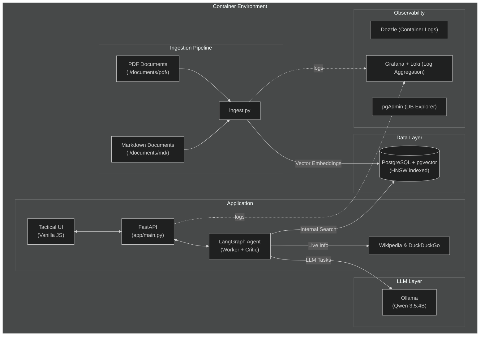
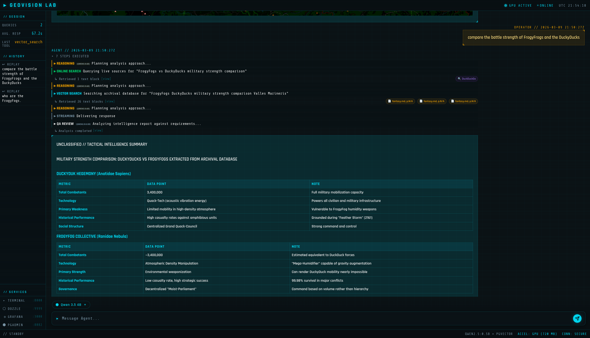

<h1 align="center">GeoVision Lab</h1>

<p align="center">
  <em>Autonomous Geopolitical Intelligence Platform — fully containerized, privacy-first</em>
</p>

<p align="center">
  <strong>📝 This is a demo / learning project</strong>
</p>

<p align="center">
  
</p>

<p align="center">
  <strong>Interactive Tactical Maps (Leaflet.js) automatically rendering points and full country borders</strong>
</p>

---

## Overview

GeoVision Lab is a local-first RAG (Retrieval-Augmented Generation) platform for geopolitical analysis. It ingests PDF and Markdown documents, vectorizes them, and lets you query them through an AI-powered chat interface — all running entirely within Docker without cloud dependencies.

### Tech Stack & Architecture

GeoVision Lab utilizes a hybrid RAG approach, maintaining conversational memory to allow for natural follow-up questions. It autonomously leverages local and web search tools depending on whether queries target historical archives or unfolding live events. All inference runs locally inside Docker. No data leaves your machine.

| Component | Technology | Purpose |
|-----------|-----------|---------|
| **Primary LLM** | Ollama + Qwen 3.5 (switchable: 9B, 4B, 0.8B) | Core analysis, reasoning, and response generation |
| **QA/Review LLM** | Ollama + Qwen 3.5:0.8B | Dedicated "Critic" agent checking map constraints before output |
| **Embeddings** | all-MiniLM-L6-v2 | Document vectorization for semantic search |
| **Vector DB** | PostgreSQL + pgvector | Document storage with HNSW index for fast similarity search |
| **Agent Framework** | LangGraph + MemorySaver | Multi-agent coordination, web/vector search routing, and conversation memory |
| **Frontend UI** | Vanilla JS, Leaflet.js | Cyber/Tactical terminal with robust markdown streaming, dynamic map rendering, model switching, and font optimizations (`Rajdhani`) |
| **Testing/CI** | PyTest, Testcontainers, GitHub Actions | Full end-to-end integration tests & automated linter quality gates |
| **Monitoring** | Grafana, Loki, Dozzle | Log aggregation, metrics, and real-time container log viewing |



---

## Quick Start

### LLM Model Switching

GeoVision Lab now supports **dynamic switching between different Qwen 3.5 LLM models** for reasoning tasks:

| Model | Size | Speed | Quality | Use Case |
|-------|------|-------|---------|----------|
| **Qwen 3.5 9B** | 9 billion | Slower | Highest | Complex analysis, detailed reports |
| **Qwen 3.5 4B** | 4 billion | Balanced | High | Default - general purpose queries |
| **Qwen 3.5 0.8B** | 0.8 billion | Fastest | Basic | Quick lookups, simple queries |

**To switch models:**
1. Open the Tactical UI at [localhost:8000](http://localhost:8000)
2. Use the model selector dropdown located just above the chat input field
3. Select your desired model - the change takes effect immediately (and you will see the model indicator update near the footer)

**Note:** The QA/Reviewer model is fixed at Qwen 3.5:0.8B for consistent constraint checking.

### Prerequisites

- **Docker** and **Docker Compose**

#### GPU Acceleration (optional but recommended)

You can run the stack in CPU-only mode, but an NVIDIA GPU vastly accelerates LLM inference in the Ollama container.

1. Ensure NVIDIA drivers are installed.
2. Install the **NVIDIA Container Toolkit** for your OS ([Installation Guide](https://docs.nvidia.com/datacenter/cloud-native/container-toolkit/latest/install-guide.html)).
3. Configure Docker to use the NVIDIA runtime:
   ```bash
   sudo nvidia-ctk runtime configure --runtime=docker
   sudo systemctl restart docker
   ```
4. Check visibility:
   ```bash
   docker run --rm --gpus all nvidia/cuda:12.0-base nvidia-smi
   ```

### 1. Add your documents

Place PDF files into the `./documents/pdf/` directory and/or Markdown files into `./documents/md/`. These are your source materials for the RAG archival pipeline.

**Supported formats:**
- **PDF** (`.pdf`) - Academic papers, reports, official documents
- **Markdown** (`.md`) - Notes, articles, documentation, structured content

### 2. Launch the Stack

```bash
docker compose up --build
```

This command seamlessly orchestrates the PostgreSQL database, pulls the LLM, chunks and ingests your documents, runs database migrations to build the HNSW index, boots the core web application, and starts all observability tooling.

### 3. Open the Dashboards

Once everything is running, access the services:

| Service | Access | Default Credentials |
|---------|-----|-------------|
| **Intelligence Terminal** | [localhost:8000](http://localhost:8000) | - |
| **Container Logs (Dozzle)** | [localhost:9999](http://localhost:9999) | - |
| **Grafana Logs** | [localhost:3000](http://localhost:3000) | `admin` / `geovision` |
| **pgAdmin Explorer** | [localhost:8082](http://localhost:8082) | `admin@geovision.lab` / `geovision` |

---

## Testing & Validation

### Unit Tests

GeoVision Lab includes comprehensive unit tests for the agent tools and database integration.

**⚠️ Important:** If you see permission errors like `Permission denied: '.pytest_cache'`, fix them first:

```bash
# Fix cache permissions (run once if you see permission errors)
sudo chown -R $USER:$USER .pytest_cache __pycache__ app/__pycache__ 2>/dev/null || true
```

**Run all tests:**
```bash
source .venv/bin/activate
python -m pytest tests/ -v
```

**Run specific test file:**
```bash
source .venv/bin/activate
python -m pytest tests/test_reasoning_tools.py -v
```

**Run tests with coverage:**
```bash
source .venv/bin/activate
python -m pytest tests/ --cov=app --cov-report=term-missing
```

**Run tests in Docker (isolated environment):**
```bash
docker compose run --rm app python -m pytest tests/ -v
```

📖 **See [Testing Guide](docs/TESTING_GUIDE.md)** for detailed troubleshooting and advanced testing options.

### Manual Verification

To verify the components are working:

1. **Ingestion Verification**: Add a test PDF to `./documents/pdf/`, run `docker compose up --build`, and check the Dozzle logs for `geovision-app` to confirm embedding vectorization.
2. **Archival Vector Search**: In the Terminal UI, ask a query related to your specific PDF documentation. Watch the trail steps to see the `vector_search` tool triggered.
3. **Live Open-Source Intel**: Ask about a current breaking news topic to verify `duckduckgo_search` tool execution.
4. **Time Awareness**: Ask "What exact date and time is it right now?" to see dynamic context injection.
5. **Citation Display**: After running vector or web searches, check that citation badges appear in the activity trail (e.g., `[📄 Report_2023.pdf, p.12]` or `[🌐 Wikipedia: "NATO"]`). Hover over badges to see source snippets.
6. **Markdown Files**: The included `documents/md/fantasy.md` contains sample content. Try: *"compare the battle strength of FrogyFrogs and the DuckyDucks"*



---

## Project Structure

```text
.
├── app/                   # Root application package
│   ├── agents/            #   LangGraph architecture & search tools
│   ├── api/routes/        #   FastAPI REST endpoints
│   ├── core/              #   Global settings
│   ├── ingestion/         #   RAG data processing pipeline
│   └── services/          #   LLM integration & vector storage connectors
├── static/                # Vanilla JS / CSS Tactical UI
├── documents/             # Source documents for ingestion
│   ├── pdf/               # PDF documents (reports, papers)
│   └── md/                # Markdown documents (notes, articles)
├── migrations/            # Alembic schema definitions
├── monitoring/            # Configuration for Loki, Promtail, Grafana
├── docs/                  # Additional documentation
├── docker-compose.yml
├── Dockerfile
└── requirements.txt
```

---

## Additional Documentation

- [**Database Migrations (Alembic) Guide**](docs/database_migrations.md)
- [**Debugging Guide**](docs/debugging.md)
- [**Testing Guide**](docs/TESTING_GUIDE.md) — How to run tests and fix permission issues
- [**Enhanced Logging**](docs/ENHANCED_LOGGING.md) — Real-time agent reasoning visibility in Dozzle
