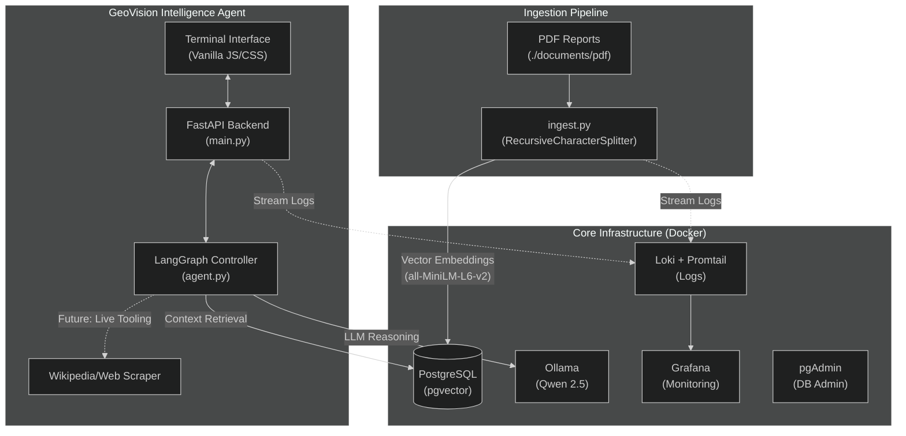

# GeoVision Lab [DEMO PROJECT FOR LEARNING]

GeoVision Lab is an autonomous geopolitical intelligence platform designed for privacy-preserving, local-first operations. It implements a hybrid RAG (Retrieval-Augmented Generation) pipeline that synthesizes information from local archival documents and live online signals.

---

## Core Capabilities

- **100% Offline Inference**: All reasoning and embedding generation are performed locally via Ollama and HuggingFace Transformers. No data leaves the local environment.
- **Hybrid Data Sources**:
    - **Offline Archival Intel**: A local directory is continuously scanned for PDF documents. These are processed, vectorized, and stored in a PostgreSQL database (pgvector) for efficient retrieval.
    - **Online Intelligence**: The agent can autonomously query live sources (e.g., Wikipedia, RSS feeds) to provide up-to-the-minute context.
- **Autonomous Reasoning**: Utilizing LangGraph, the agent identifies when to pull from historical archives versus live web sources to answer complex geopolitical queries.

---

## Architecture and Component Overview

The system utilizes a PostgreSQL-based vector store with integrated real-time monitoring and local LLM execution.



---

## Project Structure

```text
.
├── static/               # Frontend (Dark Tactical UI)
│   └── index.html
├── agent.py              # LangGraph Agent logic (Planned)
├── docker-compose.yml    # Full stack definition
├── Dockerfile            # Python backend container
├── ingest.py             # Data ingestion (PDF -> pgvector)
├── main.py               # FastAPI backend & API
├── README.md             # This file
├── requirements.txt      # Python dependencies
├── documents/            # Local document storage
│   └── pdf/              # Place PDF intelligence reports here for RAG
└── monitoring/           # Monitoring Configs
    ├── promtail-config.yaml
    ├── grafana-datasources.yaml
    ├── pgadmin-servers.json
    └── pgpass
```

---

## Quick Start

### 1. Local Model Setup
Ensure **Ollama** is installed and running on the host machine. The platform is optimized for the **Qwen 2.5** model family.

### 2. Ingest Local Documents
Place PDF files in the `./documents/pdf/` directory. The `ingest` service automatically scans this directory, shards the text, generates embeddings via `all-MiniLM-L6-v2`, and populates the vector database.

### 3. Launch the Stack
Initialize all services using Docker Compose:
```bash
docker compose up --build
```

### 4. Service Access
- **Intelligence Terminal**: [http://localhost:8000](http://localhost:8000)
- **Database Explorer (pgAdmin)**: [http://localhost:8082](http://localhost:8082)
- **Observability Dashboard (Grafana)**: [http://localhost:3000](http://localhost:3000)

---

## Agent Logic and Data Flow

The GeoVision Agent implements a multi-turn reasoning workflow using **LangGraph**:

1.  **Analysis and Triage**: The agent evaluates the user query to determine if historical context or live status is required.
2.  **RAG Fetch**: If historical context is needed, the agent queries the `historical_reports` collection in PostgreSQL, retrieving the most relevant chunks based on vector similarity.
3.  **Online Synthesis**: If current events are relevant, the agent leverages live scrapers (e.g., Wikipedia API) to gather immediate data.
4.  **Integrated Response**: The local LLM synthesizes the retrieved vector data and live signals into a comprehensive, structured assessment.

All data remains local, ensuring complete system autonomy and privacy.
