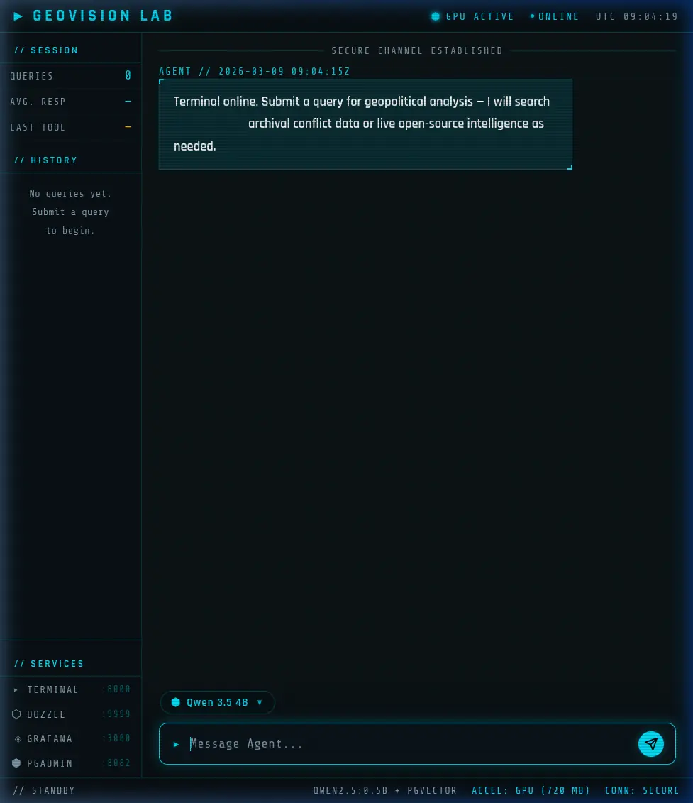
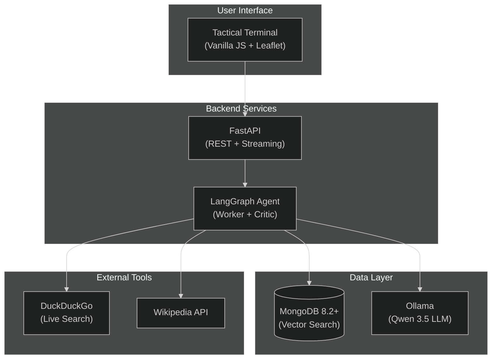

<h1 align="center">GeoVision Lab</h1>

<p align="center">
  <em>Autonomous Geopolitical Intelligence Platform — fully containerized, privacy-first</em>
</p>

<p align="center">
  <strong>📝 This is a demo / learning project</strong>
</p>

<p align="center">
  
</p>


## Overview

GeoVision Lab is a local-first RAG (Retrieval-Augmented Generation) platform for geopolitical intelligence analysis. It ingests documents (PDF, Markdown), vectorizes them using semantic embeddings, and lets you query them through an AI-powered chat interface — all running entirely within Docker without cloud dependencies.

### Key Features

- **Multi-Agent AI** — Worker + Critic architecture with autonomous tool selection
- **Hybrid Search** — Vector search (archival) + Web search (live events)
- **Dynamic Maps** — Auto-rendered Leaflet.js maps for geographic references
- **Conversational Memory** — Context-aware follow-up questions via LangGraph MemorySaver
- **Privacy-First** — All inference runs locally — no data leaves your machine
- **Observability** — Grafana + Loki logging, Dozzle real-time monitoring
- **Model Switching** — Dynamic Qwen 3.5 selection (9B/4B) at runtime

### Test Data Included

The platform ships with sample fantasy lore about the **DuckyDucks and FrogyFrogs** of Quackswamp — a rich test dataset for validating vector search capabilities.

---

## Architecture



For detailed technology decisions, see [Technology Choices](TECHNOLOGY.md).

For agent orchestration details, see [Agent Workflow](AGENT_WORKFLOW.md).

---

## Quick Start

### Prerequisites

- Docker and Docker Compose installed
- Optional: NVIDIA GPU + Container Toolkit for accelerated inference

#### GPU Acceleration (Recommended)

```bash
# Install NVIDIA drivers and Container Toolkit
sudo nvidia-ctk runtime configure --runtime=docker
sudo systemctl restart docker

# Verify GPU visibility
docker run --rm --gpus all nvidia/cuda:12.0-base nvidia-smi
```

### 1. Add Your Documents

Place PDF files into `./documents/pdf/` for the RAG archival pipeline.

### 2. Launch the Stack

```bash
docker compose up --build
```

This orchestrates:
- MongoDB with vector search index
- Ollama pulling the Qwen 3.5 LLM
- Document ingestion and chunking
- FastAPI backend with streaming
- Grafana + Loki observability stack

### 3. Access the Dashboards

| Service | URL | Credentials |
|---------|-----|-------------|
| Intelligence Terminal | [localhost:8000](http://localhost:8000) | — |
| MongoDB Browser | [localhost:8081](http://localhost:8081) | `admin` / `geovision` |
| Container Logs | [localhost:9999](http://localhost:9999) | — |
| Grafana Dashboards | [localhost:3000](http://localhost:3000) | `admin` / `geovision` |

---

## Model Switching

GeoVision Lab supports **dynamic switching between different Qwen 3.5 LLM models**:

| Model | Size | Speed | Quality | Best For |
|-------|------|-------|---------|----------|
| **Qwen 3.5 9B** | 9B | Slower | Highest | Complex analysis, detailed reports |
| **Qwen 3.5 4B** | 4B | Balanced | High | Default — general purpose |

**To switch models:**
1. Open the Tactical UI at [localhost:8000](http://localhost:8000)
2. Use the model selector dropdown above the chat input
3. Selection takes effect immediately

The QA/Reviewer model remains fixed at `Qwen 2.5:0.5b` for consistent constraint checking.

---

## Testing & Validation

### Quick Test with Included Fantasy Data

The platform includes a sample document (`documents/fantasy.md`) about the **DuckyDucks and FrogyFrogs** of Quackswamp. Use these test queries:

| Test Query | Expected Behavior |
|------------|-------------------|
| *"Where is the secret base of the DuckyDucks located?"* | Should retrieve Antarctica reference |
| *"Tell me about the War of Ripples"* | Should return details about the 6-year war (1247-1253) |
| *"What are the characteristics of FrogyFrogs?"* | Should list emerald skin, leaping ability, water magic |
| *"Who signed the Treaty of Ripples?"* | Should mention the peace treaty on a lily pad |
| *"What is the Prophecy of the Golden Tadpole?"* | Should retrieve the unity prophecy |

### Validation Checklist

1. **Ingestion** — Check Dozzle logs for `geovision-ingest` document loading
2. **Vector Search** — Ask about DuckyDucks; watch `vector_search` tool trigger
3. **Live Search** — Ask about breaking news; verify `duckduckgo_search` execution
4. **Time Awareness** — Ask "What exact date and time is it right now?"
5. **Map Rendering** — Ask "Show me Lake Featherside" to verify Leaflet integration
6. **Model Switching** — Switch between Qwen variants; observe quality/speed differences

---

## Project Structure

```
geo-vision-lab/
├── app/                    # Core application package
│   ├── agents/             # LangGraph architecture & tools
│   ├── api/routes/         # FastAPI REST endpoints
│   ├── core/               # Global settings & config
│   ├── ingestion/          # RAG data processing pipeline
│   └── services/           # LLM & MongoDB connectors
├── static/                 # Vanilla JS / CSS Tactical UI
├── documents/
│   ├── pdf/                # Your source PDFs
│   └── fantasy.md          # Sample test data
├── monitoring/             # Grafana, Loki, Promtail config
├── docs/                   # Additional documentation
├── migrations/             # Database migration scripts
├── docker-compose.yml      # Full stack orchestration
├── Dockerfile              # Application container
└── requirements.txt        # Python dependencies
```

---

## Documentation

| Document | Description |
|----------|-------------|
| [Technology Choices](docs/technology.md) | Detailed rationale for each technology decision |
| [Agent Workflow](docs/agent_workflow.md) | Deep dive into multi-agent orchestration |
| [Agent Learnings](docs/learnings.md) | Technical insights on reasoning LLMs |
| [Debugging Guide](docs/debugging.md) | Troubleshooting common issues |
| [MongoDB Vector Search](docs/mongodb_vector_search.md) | Vector search implementation details |

---

## Tech Stack Summary

| Layer | Technology |
|-------|------------|
| **LLM Inference** | Ollama + Qwen 3.5 (9B/4B) |
| **QA/Review LLM** | Ollama + Qwen 2.5:0.5b |
| **Embeddings** | all-MiniLM-L6-v2 (384 dims) |
| **Vector Database** | MongoDB 8.2+ Vector Search |
| **Agent Framework** | LangGraph + MemorySaver |
| **Backend API** | FastAPI + uvicorn |
| **Frontend UI** | Vanilla JS + Leaflet.js |
| **Testing** | PyTest + Testcontainers |
| **CI/CD** | GitHub Actions |
| **Observability** | Grafana + Loki + Dozzle |
| **Containerization** | Docker + Docker Compose |

---

<p align="center">
  <strong>Built with 🦆 for geopolitical intelligence analysis</strong>
</p>
