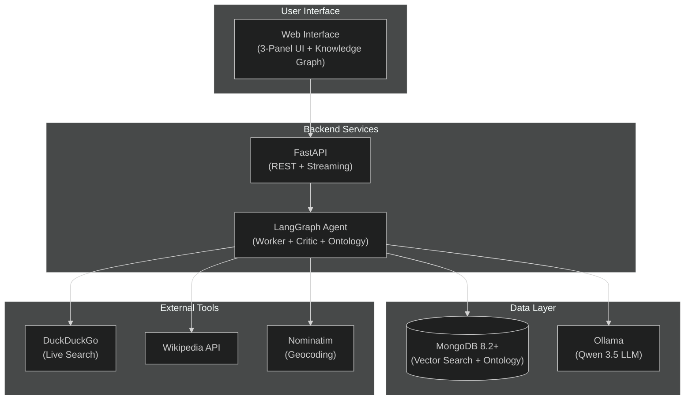

<h1 align="center">GeoVision Lab</h1>

<p align="center">
  <em>Local-first RAG platform for geopolitical analysis — fully containerized, privacy-first</em>
</p>

<p align="center">
  <strong>📝 This is a demo / learning project</strong>
</p>

<p align="center">
  
</p>


## Overview

GeoVision Lab is a local-first RAG (Retrieval-Augmented Generation) platform for geopolitical intelligence analysis. It ingests documents (PDF, Markdown), vectorizes them using semantic embeddings, and lets you query them through an AI-powered chat interface — all running entirely within Docker without cloud dependencies.

### Key Features

- **Multi-Agent AI** — Worker + Critic + Ontology Extractor architecture with autonomous tool selection
- **Hybrid Search** — Vector search (archival) + Web search (live events)
- **Automatic Knowledge Graph** — Real-time entity extraction and relationship mapping with interactive visualization
  - **7 Entity Types**: Location, Person, Organization, Event, Asset, Document, Concept
  - **Relationship Extraction**: LOCATED_IN, AFFILIATED_WITH, SUPPORTS, TARGETS, CONFLICT_WITH, LEADS, PART_OF, etc.
  - **Automatic Geocoding**: Locations are geocoded via Nominatim API with coordinates displayed on map
  - **Interactive Graph**: Curved edges, color-coded nodes by type, hover tooltips with entity properties
  - **Accumulative Graph**: Relationships build up during conversation sessions for context awareness
- **3-Panel UI** — Reasoning Chain | Text Result | Knowledge Graph with resizable panels
- **Conversational Memory** — Context-aware follow-up questions via LangGraph MemorySaver
- **Privacy-First** — All inference runs locally — no data leaves your machine
- **Observability** — Grafana + Loki logging, Dozzle real-time monitoring
- **Model Switching** — Dynamic Qwen 3.5 selection (9B/4B) at runtime
- **GPU Status Indicator** — Real-time display of GPU acceleration status

### Test Data Included

The platform ships with sample fantasy lore about the **DuckyDucks and FrogyFrogs** of Quackswamp — a rich test dataset for validating vector search capabilities.

---

## Architecture

### Main Agent Graph

```
┌─────────────────────────────────────────────────────────────────────────────┐
│                           GEO-VISION-LAB AGENT FLOW                          │
└─────────────────────────────────────────────────────────────────────────────┘

                              ┌──────────────────┐
                              │   USER QUERY     │
                              └────────┬─────────┘
                                       │
                                       ▼
                         ┌─────────────────────────┐
                         │   VECTOR_SEARCH_NODE    │
                         │   (Archival RAG Lookup) │
                         └────────────┬────────────┘
                                      │
                                      ▼
                    ┌─────────────────────────────────┐
                    │      AGENT_NODE (Worker)        │
                    │  - Receives vector search results│
                    │  - Can call tools iteratively   │
                    │  - Builds response with reasoning│
                    └────────────┬────────────────────┘
                                 │
               ┌─────────────────┴─────────────────┐
               │                                   │
               ▼                                   ▼
    ┌─────────────────────┐           ┌─────────────────────┐
    │   TOOL_NODE         │           │  REVIEWER_NODE      │
    │  - DuckDuckGo       │           │  (QA Critic LLM)    │
    │  - Wikipedia        │           │  - Validates output │
    │  - Time lookup      │           │  - Checks constraints│
    └─────────┬───────────┘           └──────────┬──────────┘
              │                                  │
              │         ┌────────────────────────┤
              │         │                        │
              │         │ (if invalid, <3 tries) │
              │         │                        │
              │         ▼                        ▼
              │   ┌─────────────┐      ┌─────────────────────┐
              │   │   Retry     │      │ ONTOLOGY_EXTRACTOR  │
              │   │   Agent     │      │   (Sub-Graph)       │
              │   └─────────────┘      │  - Entity Extraction│
              │                        │  - Link Extraction  │
              │                        │  - Geocoding        │
              └────────────────────────┘      └──────────┬──────────┘
                                      │
                                      ▼
                              ┌───────────────┐
                              │  FINAL OUTPUT │
                              │  + Knowledge  │
                              │    Graph      │
                              └───────────────┘
```

### Ontology Processing Sub-Graph

```
┌─────────────────────────────────────────────────────────────────────────────┐
│                    ONTOLOGY_SUBGRAPH (Internal Flow)                         │
└─────────────────────────────────────────────────────────────────────────────┘

    ┌──────────────────────┐
    │  assistant_response  │
    │  (Approved Text)     │
    └──────────┬───────────┘
               │
               ▼
    ┌─────────────────────────┐
    │  LLM EXTRACTION         │
    │  - Structured Output    │
    │  - 7 Entity Types       │
    │  - Relationship Types   │
    └──────────┬──────────────┘
               │
               ├─────────────────┬─────────────────┐
               ▼                 ▼                 ▼
    ┌─────────────────┐ ┌─────────────────┐ ┌─────────────────┐
    │  LOCATIONS      │ │  OTHER ENTITIES │ │  RELATIONSHIPS  │
    │  - Geocode      │ │  - Normalize    │ │  - Link         │
    │  - Nominatim    │ │  - ID Gen       │ │  - Merge        │
    └────────┬────────┘ └────────┬────────┘ └────────┬────────┘
             │                   │                   │
             └───────────────────┼───────────────────┘
                                 ▼
                    ┌─────────────────────────┐
                    │  MERGE INTO SESSION     │
                    │  - Upsert Entities      │
                    │  - Upsert Links         │
                    │  - Append Mentions      │
                    └──────────┬──────────────┘
                               │
                               ▼
                    ┌─────────────────────────┐
                    │  Session Ontology       │
                    │  (Accumulated Graph)    │
                    └─────────────────────────┘
```

**Entity Types Extracted:**
- Location, Person, Organization, Event, Asset, Document, Concept

**Relationship Types:**
- LOCATED_IN, AFFILIATED_WITH, SUPPORTS, TARGETS, CONFLICT_WITH, LEADS, PART_OF, etc.

### System Architecture


```mermaid
%%{init: {'theme': 'dark'}}%%
graph TB
    subgraph User["User Interface"]
        UI["Web Interface<br/>(3-Panel UI + Knowledge Graph)"]
    end

    subgraph Backend["Backend Services"]
        API["FastAPI<br/>(REST + Streaming)"]
        AGENT["LangGraph Agent<br/>(Worker + Critic + Ontology)"]
    end

    subgraph Data["Data Layer"]
        MDB[("MongoDB 8.2+<br/>(Vector Search + Ontology)")]
        OL["Ollama<br/>(Qwen 3.5 LLM)"]
    end

    subgraph Tools["External Tools"]
        WEB["DuckDuckGo<br/>(Live Search)"]
        WIKI["Wikipedia API"]
        NOM["Nominatim<br/>(Geocoding)"]
    end

    UI --> API
    API --> AGENT
    AGENT --> MDB
    AGENT --> OL
    AGENT --> WEB
    AGENT --> WIKI
    AGENT --> NOM
```

For detailed technology decisions, see [Technology Choices](docs/technology.md).

For agent orchestration details, see [Agent Workflow](docs/agent_workflow.md).

For ontology system details, see [Ontology System](docs/ontology.md).

---

## Quick Start

### Prerequisites

- Docker and Docker Compose installed
- Optional: NVIDIA GPU + Container Toolkit for accelerated inference

#### GPU Acceleration (Recommended)

```bash
# Install NVIDIA drivers and Container Toolkit
sudo nvidia-ctk runtime configure --runtime=docker
sudo systemctl restart docker

# Verify GPU visibility
docker run --rm --gpus all nvidia/cuda:12.0-base nvidia-smi
```

### 1. Add Your Documents

Place PDF files into `./documents/pdf/` for the RAG archival pipeline.

### 2. Launch the Stack

```bash
docker compose up --build
```

This orchestrates:
- MongoDB with vector search index
- Ollama pulling the Qwen 3.5 LLM
- Document ingestion and chunking
- FastAPI backend with streaming
- Grafana + Loki observability stack

### 3. Access the Dashboards

| Service | URL | Credentials |
|---------|-----|-------------|
| Web Interface | [localhost:8000](http://localhost:8000) | — |
| MongoDB Browser | [localhost:8081](http://localhost:8081) | `admin` / `geovision` |
| Container Logs | [localhost:9999](http://localhost:9999) | — |
| Grafana Dashboards | [localhost:3000](http://localhost:3000) | `admin` / `geovision` |

**Optional: LangSmith Tracing** - See [docs/langsmith.md](docs/langsmith.md) for setup.

---

## Model Switching

GeoVision Lab supports **dynamic switching between different Qwen 3.5 LLM models**:

| Model | Size | Speed | Quality | Best For |
|-------|------|-------|---------|----------|
| **Qwen 3.5 9B** | 9B | Slower | Highest | Complex analysis, detailed reports |
| **Qwen 3.5 4B** | 4B | Balanced | High | Default — general purpose |

**To switch models:**
1. Open the Web Interface at [localhost:8000](http://localhost:8000)
2. Use the model selector dropdown above the chat input
3. Selection takes effect immediately

**Single LLM Strategy:** Qwen 3.5 handles all tasks (reasoning, validation, ontology extraction). Switch between 9B (complex analysis) and 4B (general use) as needed.

---

## Testing & Validation

### Quick Test with Included Fantasy Data

The platform includes a sample document (`documents/fantasy.md`) about the **DuckyDucks and FrogyFrogs** of Quackswamp. Use these test queries:

| Test Query | Expected Behavior |
|------------|-------------------|
| *"Where is the secret base of the DuckyDucks located?"* | Should retrieve Antarctica reference |
| *"Tell me about the War of Ripples"* | Should return details about the 6-year war (1247-1253) |
| *"What are the characteristics of FrogyFrogs?"* | Should list emerald skin, leaping ability, water magic |
| *"Who signed the Treaty of Ripples?"* | Should mention the peace treaty on a lily pad |
| *"What is the Prophecy of the Golden Tadpole?"* | Should retrieve the unity prophecy |

### Validation Checklist

1. **Ingestion** — Check Dozzle logs for `geovision-ingest` document loading
2. **Vector Search** — Ask about DuckyDucks; watch `vector_search` tool trigger
3. **Live Search** — Ask about breaking news; verify `duckduckgo_search` execution
4. **Time Awareness** — Ask "What exact date and time is it right now?"
5. **Ontology Extraction** — Ask about real geopolitical entities (e.g., "Tell me about the conflict in Ukraine"); verify entities and relationships appear in Knowledge Graph panel
6. **Location Geocoding** — Ask about specific cities/countries; verify coordinates are extracted
7. **Model Switching** — Switch between Qwen variants; observe quality/speed differences
8. **3-Panel UI** — Verify Reasoning Chain shows workflow steps, Text Result shows response, Knowledge Graph shows entities and relationships
9. **Resizable Panels** — Drag the vertical handles between panels to adjust widths
10. **GPU Status** — Check the top panel shows correct GPU status (Active/Standby/CPU Only)

---

## Project Structure

```
geo-vision-lab/
├── app/                    # Core application package
│   ├── agents/             # LangGraph architecture & tools
│   ├── api/routes/         # FastAPI REST endpoints
│   ├── core/               # Global settings & config
│   ├── ingestion/          # RAG data processing pipeline
│   └── services/           # LLM & MongoDB connectors
├── static/                 # Vanilla JS / CSS Web Interface
├── documents/
│   ├── pdf/                # Your source PDFs
│   └── fantasy.md          # Sample test data
├── monitoring/             # Grafana, Loki, Promtail config
├── docs/                   # Additional documentation
├── migrations/             # Database migration scripts
├── docker-compose.yml      # Full stack orchestration
├── Dockerfile              # Application container
└── requirements.txt        # Python dependencies
```

---

## Documentation

| Document | Description |
|----------|-------------|
| [Technology Choices](docs/technology.md) | Detailed rationale for each technology decision |
| [Agent Workflow](docs/agent_workflow.md) | Deep dive into multi-agent orchestration |
| [Ontology System](docs/ontology.md) | Knowledge graph architecture and entity extraction |
| [Agent Learnings](docs/learnings.md) | Technical insights on reasoning LLMs |
| [Debugging Guide](docs/debugging.md) | Troubleshooting common issues |
| [MongoDB Vector Search](docs/mongodb_vector_search.md) | Vector search implementation details |

---

## Tech Stack Summary

| Layer | Technology |
|-------|------------|
| **LLM Inference** | Ollama + Qwen 3.5 (9B/4B) - single model for all tasks |
| **Ontology Extraction** | LLM structured output + Nominatim geocoding |
| **Embeddings** | all-MiniLM-L6-v2 (384 dims) |
| **Vector Database** | MongoDB 8.2+ Vector Search |
| **Agent Framework** | LangGraph + MemorySaver (with ontology subgraph) |
| **Backend API** | FastAPI + uvicorn |
| **Frontend UI** | Vanilla JS + Knowledge Graph visualization |
| **Geocoding** | Nominatim API |
| **Testing** | PyTest + Testcontainers |
| **CI/CD** | GitHub Actions |
| **Observability** | Grafana + Loki + Dozzle |
| **Tracing & Debugging** | LangSmith (self-hosted) |
| **Containerization** | Docker + Docker Compose |

---