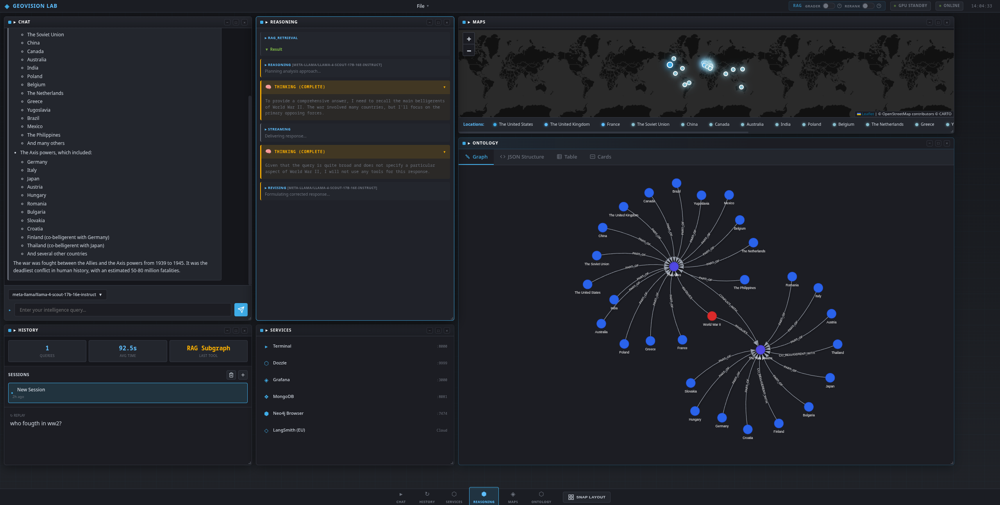
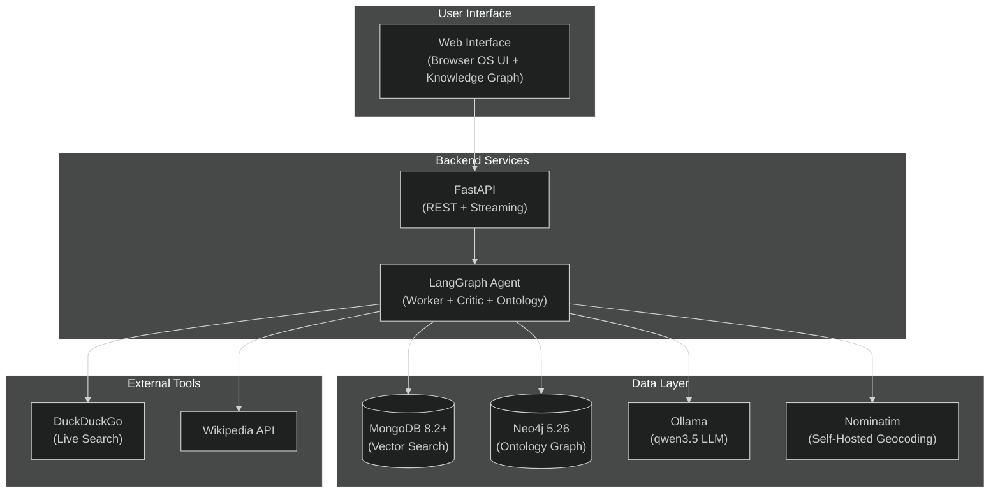

<h1 align="center">GeoVision Lab</h1>

<p align="center">
  <em>AI-powered geopolitical analysis platform — hybrid LLM, automatic knowledge graphs, browser-style desktop UI</em>
</p>

<p align="center">
  <strong>This is a demo / learning project</strong>
</p>

<p align="center">
  
</p>

<p align="center">
  <strong>Version:</strong> v0.4.0
</p>


## Overview

GeoVision Lab is a RAG (Retrieval-Augmented Generation) platform for geopolitical intelligence analysis. It ingests documents (PDF, Markdown), vectorizes them using semantic embeddings, and lets you query them through an AI-powered chat interface. Supports both **local LLM inference** (Ollama with qwen3.5 models) and **cloud LLM fallback** (Groq with Llama 4 Scout) — switch between online/offline modes as needed.

### Key Features

- **Multi-Agent AI** — Worker + Critic + Ontology Extractor architecture with autonomous tool selection
- **Hybrid Search** — Vector search (archival) + Web search (live events)
- **Automatic Knowledge Graph** — Real-time entity extraction and relationship mapping with interactive visualization
  - **7 Entity Types**: Location, Person, Organization, Event, Asset, Document, Concept
  - **Relationship Extraction**: LOCATED_IN, AFFILIATED_WITH, SUPPORTS, TARGETS, CONFLICT_WITH, LEADS, PART_OF, etc.
  - **Automatic Geocoding**: Locations are geocoded via Nominatim API with coordinates displayed on map
  - **Interactive Graph**: Curved edges, color-coded nodes by type, hover tooltips with entity properties
  - **Accumulative Graph**: Relationships build up during conversation sessions for context awareness
  - **Neo4j Graph Database**: Native graph storage with Cypher queries and cross-session persistence
  - **Ontology-Aware RAG**: Graph context augments document retrieval for richer answers
- **Browser-Style OS UI** — Web desktop interface with resizable, draggable, overlapping windows that snap into place
  - **Reasoning Chain Window** — Real-time workflow step visualization
  - **Chat Result Window** — AI response display
  - **Knowledge Graph Window** — Interactive entity/relationship visualization
  - **Free Positioning** — Windows can be moved, resized, and arranged freely
- **Conversational Memory** — Context-aware follow-up questions via LangGraph MemorySaver
- **Hybrid LLM Support** — Switch between local Ollama (qwen3.5:9b/4b) and cloud Groq (Llama 4 Scout) at runtime
- **Model Switching** — Dynamic qwen3.5 selection (9b/4b) at runtime for local inference
- **GPU Status Indicator** — Real-time display of GPU acceleration status
- **Configurable RAG Features** — Toggle context grading and re-ranking on/off via UI or environment variables
  - **Context Grading**: Evaluates retrieval quality before generation (Corrective RAG pattern)
  - **BGE Re-ranker**: Improves precision with cross-encoder re-ranking (optional, +150ms latency)

### Test Data Included

The platform ships with sample fantasy lore about the **DuckyDucks and FrogyFrogs** of Quackswamp — a rich test dataset for validating vector search capabilities.

---

## Architecture

### Complete Agent Flow


```mermaid
%%{init: {'theme': 'dark', 'themeVariables': { 'fontSize': '11px', 'lineColor': '#666666'}}}%%
flowchart TD
    User["User Query"] --> RAGSubgraph["RAG SUBGRAPH<br/>Retrieval + Grading + Re-ranking"]

    subgraph RAGSubgraph["RAG SUBGRAPH"]
        direction TB
        VectorSearch["Vector Search<br/>Archival Lookup<br/>k=20 candidates"]
        ReRanker["Re-ranker<br/>BGE Cross-Encoder<br/>Top-K selection"]
        Grader["Grader<br/>Context Relevance<br/>RELEVANT/IRRELEVANT"]
        VectorSearch --> ReRanker
        ReRanker --> Grader
    end

    RAGSubgraph --> Agent["AGENT_NODE<br/>Worker LLM<br/>Reasoning + Tool Selection"]

    Agent --> ShouldContinue{"Has tool<br/>calls?"}

    ShouldContinue -->|Yes| Tools["TOOL_NODE<br/>DuckDuckGo / Wikipedia / Time"]
    ShouldContinue -->|No| Reviewer["REVIEWER_NODE<br/>QA Critic LLM"]

    Tools --> Agent

    Reviewer --> IsValid{"Response<br/>VALID?"}

    IsValid -->|No, <3 attempts| Agent
    IsValid -->|No, ≥3 attempts| Final["Final Output + Knowledge Graph"]
    IsValid -->|Yes| OntologySubgraph

    subgraph OntologySubgraph["ONTOLOGY_EXTRACTOR SUBGRAPH"]
        direction TB
        ExtractOntology["extract_ontology<br/>Extract entities & links<br/>Identify gap references"]

        ExtractOntology --> ProcessEntities["Process Entities<br/>Generate UUIDs"]

        ProcessEntities --> IsLocation{"Is<br/>Location?"}

        IsLocation -->|Yes| Geocode["Geocode Location<br/>Nominatim API<br/>lat, lon, country"]
        IsLocation -->|No| BuildMap["Build Name to UUID Map"]

        Geocode --> BuildMap

        BuildMap --> DetectGaps["detect_gaps<br/>Check for missing<br/>entity references"]

        DetectGaps --> HasGaps{"Gap<br/>entities<br/>found?"}

        HasGaps -->|Yes| ExtractGap["extract_gap_entities<br/>Targeted LLM extraction<br/>for missing entities only"]
        HasGaps -->|No| MergeFinalize["merge_and_finalize<br/>Create entities with UUIDs<br/>Process all links"]

        ExtractGap --> MergeFinalize

        MergeFinalize --> LinksOK{"All links<br/>resolvable?"}

        LinksOK -->|No - Skip| LogHallucinated["Log as hallucinated<br/>relationship"]
        LinksOK -->|Yes| CreateLink["Create link<br/>with UUIDs"]

        LogHallucinated --> Neo4j["Neo4j Graph DB<br/>Native Graph Storage"]
        CreateLink --> Neo4j
    end

    style Geocode fill:#1e5f4a,stroke:#3a8a6a,stroke-width:2px

    Neo4j --> Final

    style User fill:#2d5016,stroke:#4a8a2a,stroke-width:2px
    style Final fill:#2d5016,stroke:#4a8a2a,stroke-width:2px
    style Agent fill:#1e3a5f,stroke:#3a5a8a,stroke-width:2px
    style Reviewer fill:#5f1e3a,stroke:#8a3a5a,stroke-width:2px
    style Tools fill:#5f4a1e,stroke:#8a6a3a,stroke-width:2px
    style RAGSubgraph fill:#1e5f4a,stroke:#3a8a6a,stroke-width:2px
    style SessionOntology fill:#2d5016,stroke:#4a8a2a,stroke-width:2px
    style Neo4j fill:#2d5016,stroke:#4a8a2a,stroke-width:2px
    style IsValid fill:#4a2d1e,stroke:#6a4a3a,stroke-width:2px
    style HasGaps fill:#4a2d1e,stroke:#6a4a3a,stroke-width:2px
    style ShouldContinue fill:#4a2d1e,stroke:#6a4a3a,stroke-width:2px
    style LinksOK fill:#4a2d1e,stroke:#6a4a3a,stroke-width:2px
    style OntologySubgraph fill:#1a1a2e,stroke:#5a3a8a,stroke-width:3px,stroke-dasharray: 5 5
```

**Flow Description:**

1. **RAG Subgraph** (mandatory first step) - Retrieves and grades archival context:
   - **Vector Search**: Searches MongoDB vector store for relevant documents (retrieves 20 candidates)
   - **Re-ranker** (optional): BGE cross-encoder re-ranks candidates for better precision, selects top-K (default: 3)
   - **Grader**: Evaluates context relevance (RELEVANT, PARTIALLY_RELEVANT, IRRELEVANT)
   - **Context Injection**: Relevant context is injected; irrelevant context triggers a hint to use web tools

2. **Agent** - Worker LLM receives context, performs reasoning, decides on tool usage

3. **Tools** - DuckDuckGo, Wikipedia, Time lookup (loop back to Agent for iterative reasoning)

4. **Reviewer** - QA Critic validates response against constraints

5. **Ontology Extractor Subgraph** (dashed border) - Two-pass extraction with gap resolution:
   - **extract_ontology**: Extract entities (7 types), extract links, identify missing references
   - **Process Entities**: Generate UUIDs for all entities
   - **Geocode Locations**: Location entities are geocoded via Nominatim API (lat, lon, country)
   - **detect_gaps**: Check if any link targets don't exist as entities
   - **extract_gap_entities** (if gaps): Targeted LLM extraction for missing entities only
   - **merge_and_finalize**: Create entities with UUIDs, process all links, skip unresolvable

6. **Final Output** - Response + accumulated knowledge graph persisted to Neo4j

**Entity Types Extracted:**
- Location, Person, Organization, Event, Asset, Document, Concept

**Relationship Types:**
- Spatial: LOCATED_IN, STATIONED_IN, OPERATES_IN, HEADQUARTERED_IN, DEPLOYS_TO
- Organizational: AFFILIATED_WITH, PART_OF, LEADS, COMMANDS, REPORTS_TO, FOUNDED
- Political/Military: SUPPORTS, TARGETS, CONFLICT_WITH, ATTACKED, DEFENDS, ALLIES_WITH, SANCTIONS, ARMS, TRAINS
- Territorial: OCCUPIES, CONTROLS, LIBERATES, CAPTURES, SEIZES, FORTIFIES, BLOCKADES
- Diplomatic: NEGOTIATES_WITH, MET_WITH, VISITED, SIGNATORY_TO, RATIFIES, MEDIATES
- Legal/Judicial: INVESTIGATES, INDICTS, PROSECUTES, ARRESTS, EXTRADITES, SANCTIONED_BY
- Economic: OWNS, ACQUIRES, MERGES_WITH, PARTNERS_WITH, FUNDS, BOYCOTTS, GRANTS_AID_TO
- Generic: USES, RELATED_TO, COLLABORATES_WITH, INFLUENCED_BY, DERIVED_FROM
- **Note:** The system can discover and extract additional relationship types beyond this predefined list based on the text content.

#### Knowledge Graph Visualization

The ontology system automatically extracts entities and relationships from the AI's reasoning output and displays them in an interactive knowledge graph:

**Visual Features:**
- **Color-coded nodes** by entity type (blue=Location, orange=Person, purple=Organization, red=Event, green=Asset, etc.)
- **Curved edges** with clear relationship labels (e.g., CONFLICT_WITH, LOCATED_IN, TARGETS)
- **Hover tooltips** showing entity properties and metadata
- **Dynamic layout** using force-directed physics for optimal spacing
- **Accumulative graph** that grows as the conversation progresses

**Example Output:**
When querying "What happened in Iran last week?", the knowledge graph automatically builds a network showing:
- Countries and cities (Iran, Israel, Qatar, Gulf states)
- Key figures (President Trump, military leaders)
- Military bases and infrastructure (Ras Laffan Industrial City, Meyssam Tammar Basij base)
- Relationships between entities (ATTACKED, LOCATED_IN, SENT_PLAN_TO, etc.)

### System Architecture


```mermaid
%%{init: {'theme': 'dark'}}%%
graph TB
    subgraph User["User Interface"]
        UI["Web Interface<br/>(Browser OS UI + Knowledge Graph)"]
    end

    subgraph Backend["Backend Services"]
        API["FastAPI<br/>(REST + Streaming)"]
        AGENT["LangGraph Agent<br/>(Worker + Critic + Ontology)"]
    end

    subgraph Data["Data Layer"]
        MDB[("MongoDB 8.2+<br/>(Vector Search)")]
        N4J[("Neo4j 5.26<br/>(Ontology Graph)")]
        OL["Ollama<br/>(qwen3.5 LLM)"]
        NOM["Nominatim<br/>(Self-Hosted Geocoding)"]
    end

    subgraph Tools["External Tools"]
        WEB["DuckDuckGo<br/>(Live Search)"]
        WIKI["Wikipedia API"]
    end

    UI --> API
    API --> AGENT
    AGENT --> MDB
    AGENT --> N4J
    AGENT --> OL
    AGENT --> NOM
    AGENT --> WEB
    AGENT --> WIKI
```

### Data Storage Strategy: Polyglot Persistence

The platform purposefully duplicates session ontology data across two databases to optimize for different read/write patterns:
- **MongoDB (UI State & Snapshots)**: Acts as the primary document store. The entire session context (chat messages and the raw JSON ontology tree) is continually saved here. This allows the backend to restore a session's UI state instantly with an $O(1)$ query, without needing to reconstruct the graph structure from scratch.
- **Neo4j (AI Querying & Traversal)**: The ontology is synchronously mirrored to Neo4j. This graph database allows the AI agent to execute complex, multi-hop Cypher queries (e.g., finding all indirectly affiliated organizations of a person) in milliseconds during the reasoning pipeline.

For detailed technology decisions, see [Technology Choices](docs/technology.md).

For agent orchestration details, see [Agent Workflow](docs/agent_workflow.md).

For ontology system details, see [Ontology System](docs/ontology.md).

---

## Quick Start

### Prerequisites

- Docker and Docker Compose installed
- Optional: NVIDIA GPU + Container Toolkit for accelerated inference
- Optional: Groq API key for cloud LLM fallback (get free key at [console.groq.com](https://console.groq.com))

#### GPU Acceleration (Recommended)

```bash
# Install NVIDIA drivers and Container Toolkit
sudo nvidia-ctk runtime configure --runtime=docker
sudo systemctl restart docker

# Verify GPU visibility
docker run --rm --gpus all nvidia/cuda:12.0-base nvidia-smi
```

### 1. Configure Environment (Optional)

Copy `.env.example` to `.env` and configure:

```bash
# For cloud LLM fallback (optional)
GROQ_API_KEY=your-groq-api-key
USE_ONLINE_LLM=false

# For self-hosted Nominatim (optional - avoids rate limiting)
NOMINATIM_URL=http://nominatim:8080/search
```

### 2. Add Your Documents

Place PDF files into `./documents/pdf/` for the RAG archival pipeline.

### 3. Launch the Stack

```bash
docker compose up --build
```

This orchestrates:
- MongoDB with vector search index
- Neo4j graph database for ontology storage
- Ollama pulling qwen3.5:9b and qwen3.5:4b models
- Nominatim self-hosted geocoding service (Europe OSM data)
- Document ingestion and chunking
- FastAPI backend with streaming
- Grafana + Loki observability stack

### 4. Access the Dashboards

| Service | URL | Credentials |
|---------|-----|-------------|
| Web Interface | [localhost:8000](http://localhost:8000) | — |
| MongoDB Browser | [localhost:8081](http://localhost:8081) | `admin` / `geovision` |
| Neo4j Browser | [localhost:7474](http://localhost:7474) | `neo4j` / `geovision` |
| Nominatim Geocoding | [localhost:8083](http://localhost:8083) | — |
| Container Logs | [localhost:9999](http://localhost:9999) | — |
| Grafana Dashboards | [localhost:3000](http://localhost:3000) | `admin` / `geovision` |

**Optional: LangSmith Tracing** - See [docs/langsmith.md](docs/langsmith.md) for setup.

---

## Self-Hosted Nominatim Geocoding

GeoVision Lab includes a **self-hosted Nominatim service** for geocoding location names to coordinates. This avoids rate limiting issues with the public Nominatim API (which limits to 1 request/second) and provides faster, more reliable geocoding.

### Configuration

The self-hosted Nominatim service is enabled by default in Docker Compose. It pre-loads OpenStreetMap data for Europe during initial startup.

**Environment Variables:**

```bash
# Self-hosted Nominatim (default)
NOMINATIM_URL=http://nominatim:8080/search
NOMINATIM_TIMEOUT=10
```

**To use the public Nominatim API instead**, leave `NOMINATIM_URL` empty in your `.env` file:

```bash
NOMINATIM_URL=
```

The application will automatically fall back to the public API if the self-hosted service is unavailable.

### Resource Requirements

| Component | Minimum | Recommended |
|-----------|---------|-------------|
| RAM | 4 GB | 8 GB |
| Storage | 20 GB | 50 GB (SSD) |
| CPU | 2 cores | 4 cores |
| Initial Import | ~60 min | ~30 min |

### Initial Import

On first startup, Nominatim downloads and imports Europe OSM data from Geofabrik. This takes **30-60 minutes** depending on your hardware and network speed. The service health check will monitor import progress.

**For development/testing**, you can use smaller extracts by modifying `docker-compose.yml`:

```yaml
environment:
  - PBF_URL=https://download.geofabrik.de/germany-latest.osm.pbf
  - REPLICATION_URL=https://download.geofabrik.de/germany-updates/
```

### Access

- **API Endpoint**: `http://localhost:8083/search?q=Berlin&format=json`
- **Web Interface**: [localhost:8083](http://localhost:8083)

### Benefits

- No rate limiting
- Faster response times (local network)
- Reliable availability
- Full control over data updates
- Better for development/testing

---

## Model Switching

GeoVision Lab supports **hybrid LLM deployment** with both local and cloud models:

### Local Models (Ollama)

> [!WARNING]
> The included smaller models (`qwen3.5:9b` and `qwen3.5:4b`) are often too weak for proper, reliable ontology extraction and should primarily be used for testing and development. It is highly recommended to add and configure more capable local models when your hardware allows it to ensure high-quality knowledge graph generation.

| Model | Size | Speed | Quality | Best For |
|-------|------|-------|---------|----------|
| **qwen3.5:9b** | 9B | Slower | Highest | Complex analysis, detailed reports (Testing) |
| **qwen3.5:4b** | 4B | Balanced | High | Default — general purpose (Testing) |

**To switch local models:**
1. Open the Web Interface at [localhost:8000](http://localhost:8000)
2. Use the model selector dropdown above the chat input
3. Selection takes effect immediately

### Cloud Models (Groq)

| Model | Provider | Speed | Quality | Best For |
|-------|----------|-------|---------|----------|
| **meta-llama/llama-4-scout-17b-16e-instruct** | Groq | Fast | High | Live events, current affairs |

**To enable cloud LLM:**
1. Get a Groq API key at [console.groq.com](https://console.groq.com)
2. Add `GROQ_API_KEY=your-api-key` to your `.env` file
3. Set `USE_ONLINE_LLM=true` in `.env`
4. Restart the application or toggle via Web Interface (if available)

**Hybrid Strategy:** Use local qwen3.5 models for privacy-sensitive analysis and cloud Groq models for live events requiring up-to-date information. Switch between modes as needed.

---

## RAG Configuration

GeoVision Lab supports **configurable RAG features** that can be toggled on/off independently via environment variables or the web UI.

### Features

| Feature | Description | Recommended |
|---------|-------------|-------------|
| **Context Grading** | Evaluates retrieval quality before generation (Corrective RAG pattern) | Enabled |
| **BGE Re-ranker** | Improves precision with cross-encoder re-ranking | Enabled |

### Configuration via Environment Variables

Add to your `.env` file:

```bash
# RAG Features Configuration
RAG_GRADER_ENABLED=true           # Enable/disable context grading
RAG_RERANKER_ENABLED=true         # Enable/disable BGE re-ranker
RAG_RERANKER_MODEL=BAAI/bge-reranker-v2-m3
RAG_RERANKER_TOP_K=3              # Number of results after re-ranking
RAG_RERANKER_CANDIDATES_K=20      # Number of candidates to retrieve
```

### Configuration via Web UI

1. Open the **Services** window in the web interface
2. Find the **RAG Configuration** panel
3. Toggle features on/off:
   - **Context Grading**: Evaluate context relevance before generation
   - **Re-ranking (BGE)**: Improve precision with cross-encoder

Changes take effect immediately for new queries.

### Feature Flows

| Configuration | Flow | Use Case |
|--------------|------|----------|
| All disabled | Vector Search → Agent | Fastest, baseline quality |
| Grader only | Vector Search → Grader → Agent | Prevents hallucinations from poor context |
| Re-ranker only | Vector Search (k=20) → Re-rank (k=3) → Agent | Better precision for technical queries |
| Both enabled (default) | Vector Search (k=20) → Re-rank (k=3) → Grader → Agent | Best quality for critical analysis |

### When to Disable Features

**Disable re-ranker for:**
- Simple queries where vector search is sufficient
- Latency-sensitive applications
- Small document collections

**Disable grader for:**
- Maximum speed when you trust vector search quality
- Testing and debugging

---

## Testing & Validation

### Quick Test with Included Fantasy Data

The platform includes a sample document (`documents/fantasy.md`) about the **DuckyDucks and FrogyFrogs** of Quackswamp. Use these test queries:

| Test Query | Expected Behavior |
|------------|-------------------|
| *"Where is the secret base of the DuckyDucks located?"* | Should retrieve Antarctica reference |
| *"Tell me about the War of Ripples"* | Should return details about the 6-year war (1247-1253) |
| *"What are the characteristics of FrogyFrogs?"* | Should list emerald skin, leaping ability, water magic |
| *"Who signed the Treaty of Ripples?"* | Should mention the peace treaty on a lily pad |
| *"What is the Prophecy of the Golden Tadpole?"* | Should retrieve the unity prophecy |

### Validation Checklist

1. **Ingestion** — Check Dozzle logs for `geovision-ingest` document loading
2. **Vector Search** — Ask about DuckyDucks; watch `vector_search` tool trigger
3. **Live Search** — Ask about breaking news; verify `duckduckgo_search` execution
4. **Time Awareness** — Ask "What exact date and time is it right now?"
5. **Ontology Extraction** — Ask about real geopolitical entities (e.g., "What happened in Iran last week?"); verify entities and relationships appear in Knowledge Graph panel with:
   - Color-coded nodes (blue locations, orange people, purple organizations)
   - Clear curved edge labels showing relationship types (ATTACKED, LOCATED_IN, etc.)
   - Hover tooltips with entity details
   - Proper node spacing without overlapping labels
6. **Location Geocoding** — Ask about specific cities/countries; verify coordinates are extracted and displayed on the map panel
7. **Model Switching** — Switch between qwen3.5:9b and qwen3.5:4b; observe quality/speed differences
8. **Browser OS UI** — Verify windows can be dragged, resized, and snapped; check Reasoning Chain shows workflow steps, Chat Result shows response, Knowledge Graph shows entities and relationships
9. **GPU Status** — Check the top panel shows correct GPU status (Active/Standby/CPU Only)
10. **Online LLM** — If Groq API key configured, verify cloud model responses for current events

---

## Project Structure

```
geo-vision-lab/
├── app/                    # Core application package
│   ├── agents/             # LangGraph architecture & tools
│   ├── api/routes/         # FastAPI REST endpoints
│   ├── core/               # Global settings & config
│   ├── ingestion/          # RAG data processing pipeline
│   ├── models/             # Pydantic models & schemas
│   └── services/           # LLM & MongoDB connectors
├── static/                 # Vanilla JS / CSS Web Interface
├── documents/
│   ├── pdf/                # Your source PDFs (includes Iran - Wikipedia.pdf)
│   ├── ignore/             # Documents excluded from ingestion
│   └── fantasy.md          # Sample test data (DuckyDucks & FrogyFrogs)
├── monitoring/             # Grafana, Loki, Promtail config
├── docs/                   # Additional documentation
├── learnings/              # Technical insights & deployment guides
├── migrations/             # Database migration scripts
├── tests/                  # PyTest test suite
├── docker-compose.yml      # Full stack orchestration
├── Dockerfile              # Application container
└── requirements.txt        # Python dependencies
```

---

## Documentation

| Document | Description |
|----------|-------------|
| [Technology Choices](docs/technology.md) | Detailed rationale for each technology decision |
| [Agent Workflow](docs/agent_workflow.md) | Deep dive into multi-agent orchestration |
| [Ontology System](docs/ontology.md) | Knowledge graph architecture and entity extraction |
| [Agent Learnings](docs/learnings.md) | Technical insights on reasoning LLMs |
| [Debugging Guide](debugging.md) | Troubleshooting common issues |
| [MongoDB Vector Search](docs/mongodb_vector_search.md) | Vector search implementation details |
| [LangSmith Tracing](docs/langsmith.md) | Setup guide for LLM tracing and debugging |
| [Dependency Injection](docs/dependency_injection.md) | DI pattern implementation details |
| [Error Handling](docs/error_handling_improvements.md) | Error handling improvements and patterns |

---

## Tech Stack Summary

| Layer | Technology |
|-------|------------|
| **LLM Inference (Local)** | Ollama + qwen3.5 (9b/4b) - switchable models |
| **LLM Inference (Cloud)** | Groq + Llama 4 Scout (17B) - optional fallback |
| **Ontology Extraction** | LLM structured output + Nominatim geocoding |
| **Graph Database** | Neo4j 5.26 (ontology storage + traversal) |
| **Embeddings** | all-MiniLM-L6-v2 (384 dims) |
| **Vector Database** | MongoDB 8.2+ Vector Search |
| **Agent Framework** | LangGraph + MemorySaver (with ontology subgraph) |
| **Backend API** | FastAPI + uvicorn |
| **Frontend UI** | Vanilla JS + Browser OS-style window manager + Knowledge Graph visualization |
| **Geocoding** | Nominatim (self-hosted with public API fallback) |
| **Testing** | PyTest + Testcontainers |
| **CI/CD** | GitHub Actions |
| **Observability** | Grafana + Loki + Dozzle |
| **Tracing & Debugging** | LangSmith (cloud or self-hosted) |
| **Containerization** | Docker + Docker Compose |

---