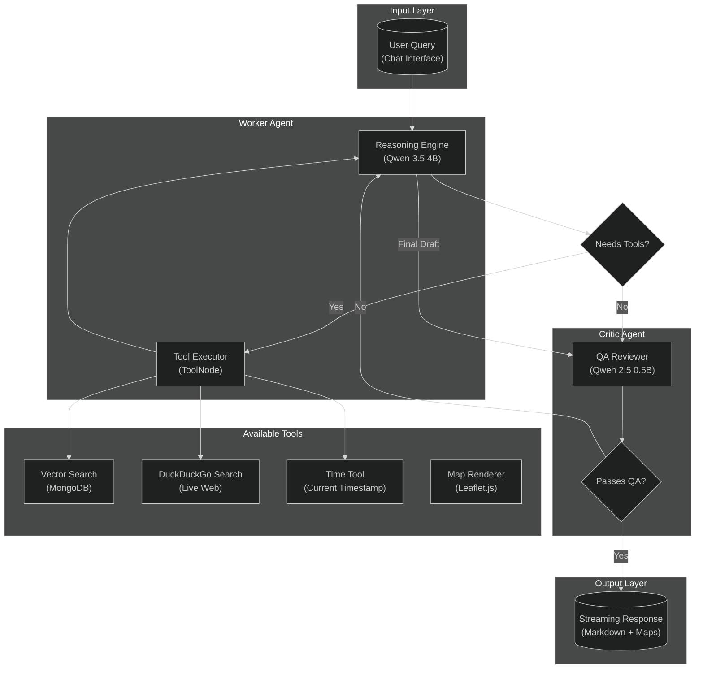
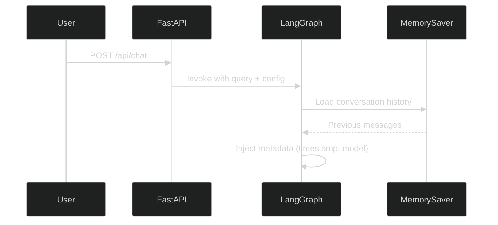
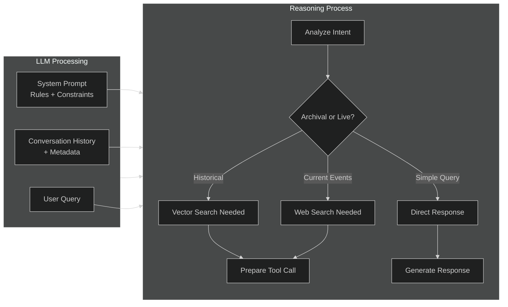
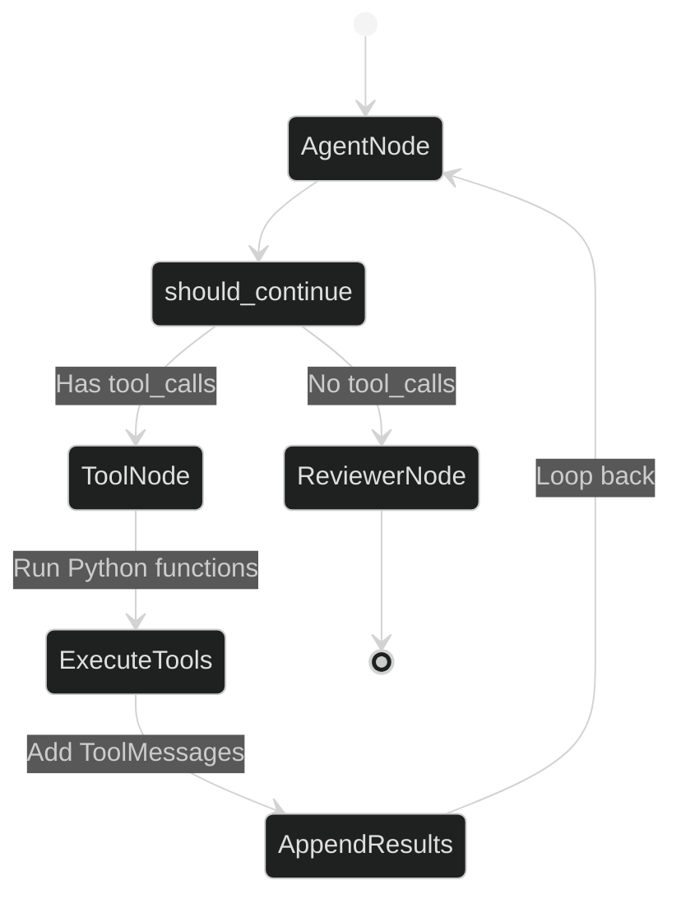
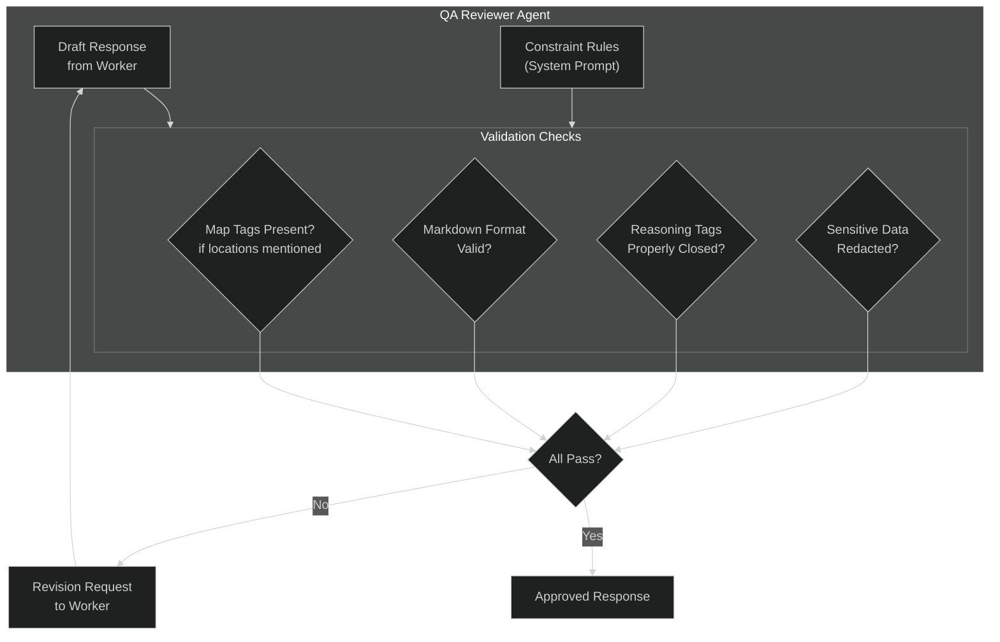
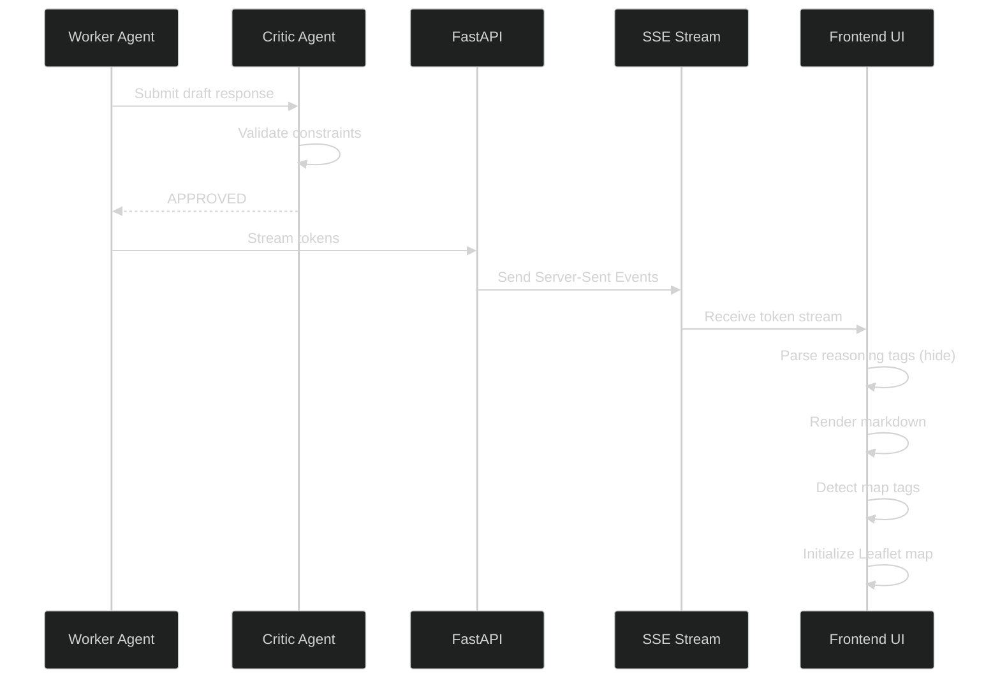
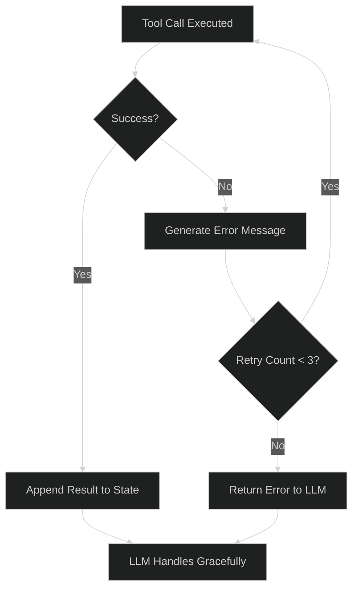

# Agent Workflow

This document provides a detailed breakdown of the LangGraph agent architecture powering GeoVision Lab's intelligence capabilities.

---

## High-Level Overview

GeoVision Lab uses a **multi-agent system** orchestrated by LangGraph. The system consists of two primary agents working in concert:

1. **Worker Agent** — The primary reasoning engine that handles user queries, performs tool calls, and synthesizes responses
2. **Critic Agent** — A QA reviewer that validates outputs against formatting constraints before delivery



---

## Agent State Management

The agent maintains state throughout the conversation using LangGraph's `AgentState`:

```python
class AgentState(TypedDict):
    """State schema for the agent graph."""
    messages: Annotated[List[BaseMessage], add_messages]
    model: str  # Current LLM model selection
    metadata: dict  # Additional context (time, etc.)
```

### Message Annotation

The `add_messages` reducer ensures that:
- New messages are appended to the conversation history
- Tool results are properly associated with their requests
- Conversation memory persists across multiple tool call iterations

---

## Workflow Stages

### Stage 1: Query Reception



**What happens:**
1. User submits a query through the chat interface
2. FastAPI receives the request and invokes the LangGraph agent
3. Agent loads previous conversation history from `MemorySaver`
4. Current timestamp and selected model are injected into state

---

### Stage 2: Reasoning & Tool Decision



**System Prompt Rules:**
- Rule 40: Must wrap thought process in `<think>...</think>` tags
- Rule 41: Must use appropriate tools based on query type
- Rule 42: Must format responses in military intelligence style
- Rule 43: Must include map tags when referencing geographic locations

---

### Stage 3: Tool Execution Loop



**Available Tools:**

| Tool | Function | Trigger Condition |
|------|----------|-------------------|
| **vector_search** | Query MongoDB for archival documents | Historical queries, document-specific questions |
| **duckduckgo_search** | Search live web for current events | Breaking news, recent developments |
| **get_current_time** | Return exact timestamp | Time-aware queries |
| **render_map** | Generate Leaflet.js map code | Geographic location references |

**Tool Call Example:**
```json
{
  "role": "assistant",
  "content": "",
  "tool_calls": [
    {
      "id": "call_abc123",
      "type": "function",
      "function": {
        "name": "vector_search",
        "arguments": "{\"query\": \"DuckyDucks secret base\"}"
      }
    }
  ]
}
```

---

### Stage 4: QA Review



**Reviewer System Prompt:**
```
You are a QA Reviewer for a geopolitical intelligence platform.
Your task is to validate that the Worker's response meets all constraints:

1. If geographic locations are mentioned, map tags MUST be present
2. Response must be in proper markdown format
3. Reasoning tags must be properly opened and closed
4. No sensitive or classified information should be exposed

If all constraints are met, respond with: APPROVED
If any constraint is violated, explain the issue and request revision.
```

---

### Stage 5: Response Streaming



**Streaming Protocol:**
```json
{
  "event": "token",
  "data": {
    "content": "## Intelligence Report\n\n",
    "type": "text"
  }
}
```

---

## Conditional Edge Logic

The `should_continue` function is the brain of the agent workflow:

```python
def should_continue(state: AgentState) -> Literal["tools", "reviewer"]:
    """
    Router function that determines the next node in the graph.
    
    Args:
        state: Current agent state containing messages
        
    Returns:
        "tools" if LLM requested tool calls
        "reviewer" if LLM is ready to finalize response
    """
    # Get the last message from the assistant
    last_message = state["messages"][-1]

    # Check if the LLM requested any tool calls
    if getattr(last_message, "tool_calls", None):
        return "tools"

    # If no tools are requested, the LLM is done with its work
    return "reviewer"
```

**Key Insights:**
- This function acts as a **conditional edge** in the LangGraph DAG
- It intercepts the LLM output before it reaches the user
- Enables autonomous decision-making without hardcoded logic
- The graph loops back to the agent after tool execution, allowing multi-step reasoning

---

## Memory Management

### Conversation Memory

LangGraph's `MemorySaver` persists conversation state:

```python
from langgraph.checkpoint.memory import MemorySaver

memory = MemorySaver()
graph = StateGraph(AgentState).compile(checkpointer=memory)
```

**Configuration Options:**
```python
config = {
    "configurable": {
        "thread_id": "user_123_session_456",
        "model": "qwen3.5:4b"
    }
}
```

### Memory Persistence

| Storage | Duration | Purpose |
|---------|----------|---------|
| **MemorySaver** | Session lifetime | Conversation history within a chat thread |
| **MongoDB** | Permanent | Document archival for vector search |
| **Browser localStorage** | User preference | UI settings (model selection, theme) |

---

## Error Handling

### Tool Call Failures



### Fallback Strategy

1. **First Attempt**: Execute tool with original parameters
2. **Second Attempt**: Retry with modified parameters (if applicable)
3. **Third Attempt**: Return error message to LLM for graceful handling
4. **Final Fallback**: LLM informs user of limitation and suggests alternatives

---

## Performance Optimization

### Latency Breakdown

| Stage | Typical Latency | Optimization |
|-------|----------------|--------------|
| **LLM Reasoning** | 500ms - 3s | Model size selection (9B/4B/0.8B) |
| **Vector Search** | 50ms - 200ms | MongoDB index tuning |
| **Web Search** | 1s - 3s | Async execution, caching |
| **QA Review** | 200ms - 500ms | Small reviewer model (0.5B) |
| **Streaming** | Real-time | Server-Sent Events (SSE) |

### Caching Strategy

```python
# Tool result caching for repeated queries
@cache(ttl=300)  # 5 minute cache
def duckduckgo_search(query: str) -> str:
    ...
```

---

## Debugging the Agent

### Enable Verbose Logging

```yaml
# docker-compose.yml
services:
  geovision-api:
    environment:
      - LOG_LEVEL=DEBUG
      - LANGCHAIN_VERBOSE=true
```

### Inspect Agent State

```python
# Add to agent.py for debugging
def debug_state(state: AgentState):
    print(f"Messages: {len(state['messages'])}")
    print(f"Last message: {state['messages'][-1]}")
    print(f"Model: {state.get('model', 'unknown')}")
```

### Visualize Graph

```python
from langgraph.graph import StateGraph

# After compiling the graph
graph.get_graph().draw_mermaid()
```

---

## Related Documentation

- [Technology Choices](TECHNOLOGY.md) — Detailed rationale for tech stack decisions
- [Agent Learnings](learnings.md) — Technical insights on reasoning LLMs and decision logic
- [Debugging Guide](docs/debugging.md) — Troubleshooting common issues

---

## References

- [LangGraph Documentation](https://langchain-ai.github.io/langgraph/)
- [LangGraph StateGraph API](https://langchain-ai.github.io/langgraph/how-tos/state-graph/)
- [Conditional Edges](https://langchain-ai.github.io/langgraph/how-tos/conditional-edges/)
- [ToolNode Implementation](https://langchain-ai.github.io/langgraph/reference/prebuilt/#langgraph.prebuilt.tool_node.ToolNode)
