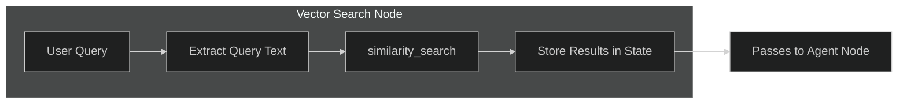
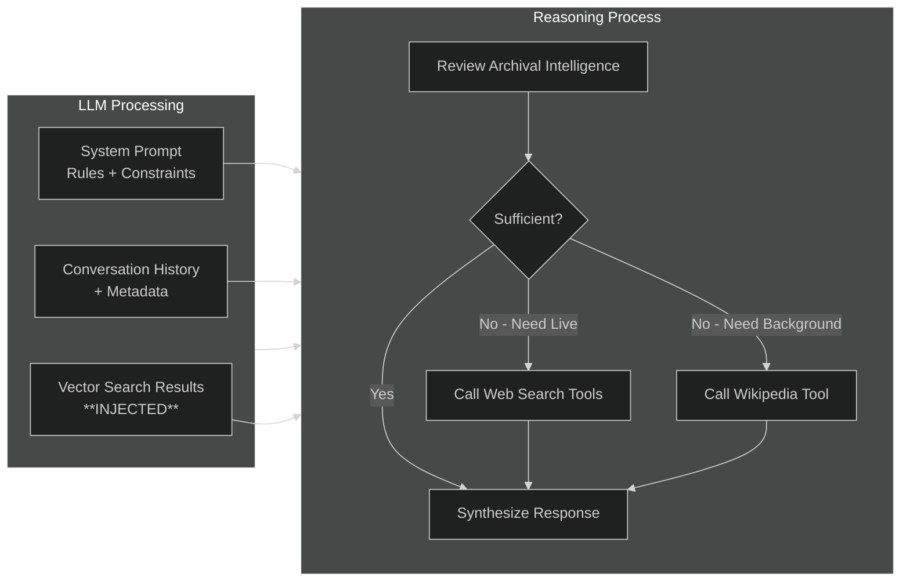
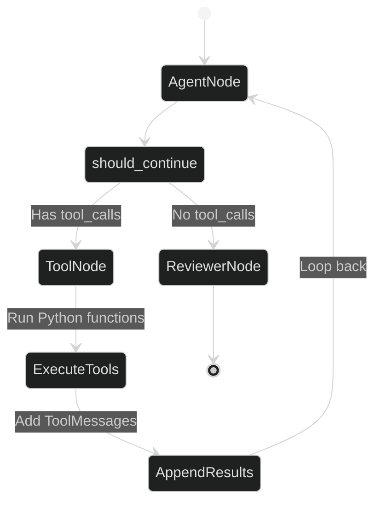
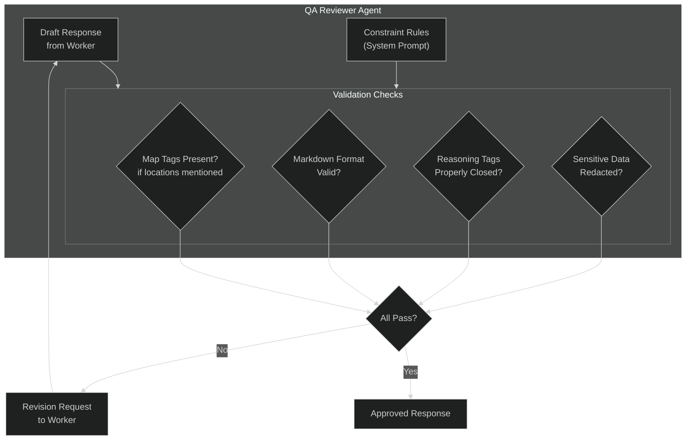
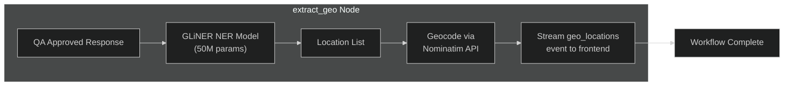
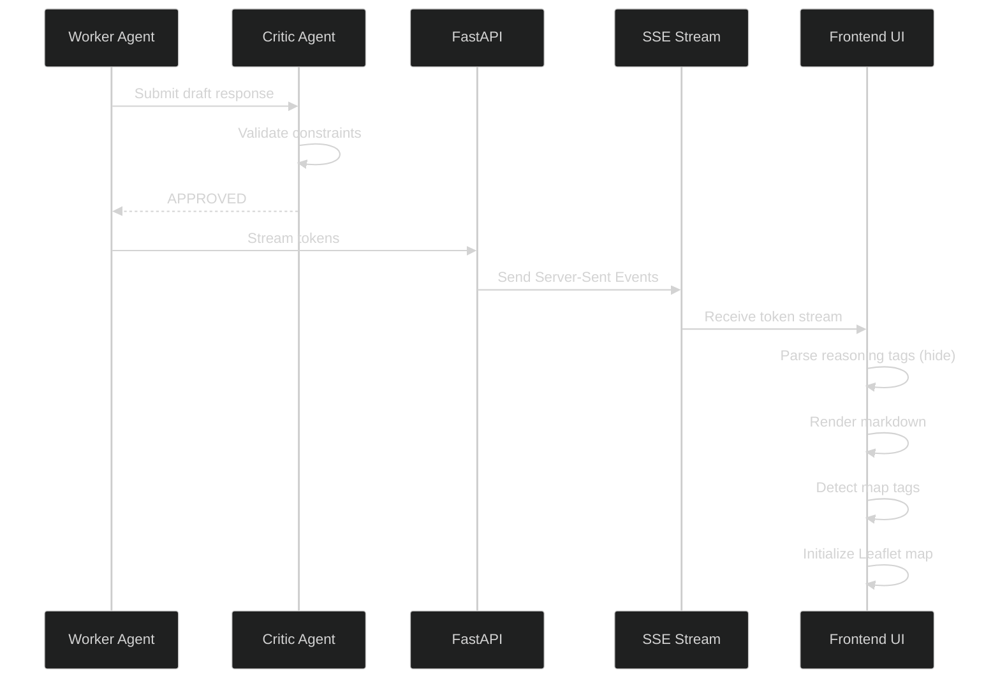
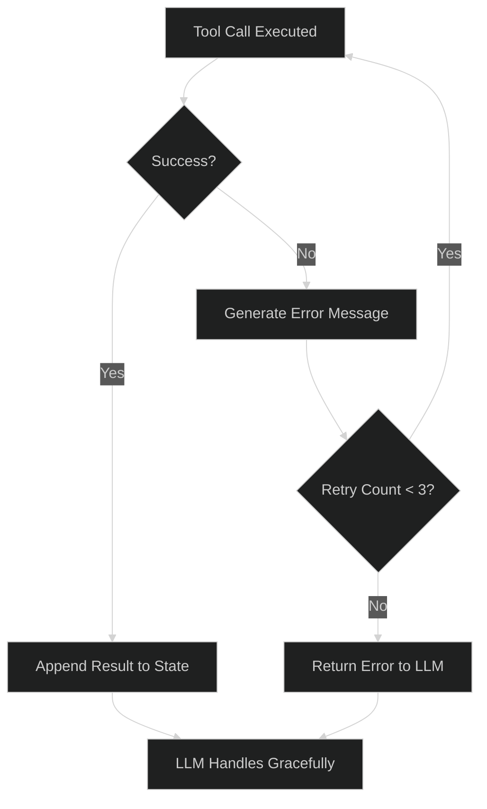

# Agent Workflow

This document provides a detailed breakdown of the LangGraph agent architecture powering GeoVision Lab's intelligence capabilities.

---

## High-Level Overview

GeoVision Lab uses a **multi-agent system** orchestrated by LangGraph. The system consists of two primary agents working in concert:

1. **Worker Agent** — The primary reasoning engine that handles user queries, performs tool calls, and synthesizes responses
2. **Critic Agent** — A QA reviewer that validates outputs against formatting constraints before delivery

## Mandatory Vector Search First Protocol

**CRITICAL**: For every user query, without exception, an offline vector search is **automatically executed** as the first step in the workflow.

### Why Vector Search First?

1. **Comprehensive Intelligence**: Ensures all locally archived documents, reports, and historical data are checked before seeking external sources
2. **Data Privacy**: Prioritizes internal/custom data over public web searches
3. **Context Awareness**: Prevents redundant searches for information already in the knowledge base
4. **Performance**: Vector search (50-200ms) is faster than web searches (1-3s)
5. **Structural Enforcement**: The workflow **guarantees** vector search executes first — not dependent on LLM decision

### Execution Flow

```
User Query → [Vector Search Node] → Agent (with results injected) → [Optional: Additional Tools] → Reviewer → Response
```

### Decision Tree

- **Step 1 (Automatic)**: `vector_search_node` executes for every query
- **Step 2**: Results stored in AgentState and injected into agent context
- **Step 3**: Agent reviews archival results, decides if additional tools needed
- **Step 4**: If additional intel needed → execute web search tools
- **Step 5**: Submit draft to Critic Agent for validation


```mermaid
%%{init: {'theme': 'dark'}}%%
graph TB
    subgraph Input["Input Layer"]
        UQ[("User Query<br/>(Chat Interface)")]
    end

    subgraph Mandatory["Mandatory First Step"]
        VS["Vector Search Node<br/>(MongoDB)<br/>**AUTOMATIC**"]
    end

    subgraph Worker["Worker Agent"]
        REASON["Reasoning Engine<br/>(Qwen 3.5 4B)<br/>+ Injected Results"]
        TOOLS["Tool Executor<br/>(ToolNode)"]
    end

    subgraph Critic["Critic Agent"]
        REVIEW["QA Reviewer<br/>(Qwen 2.5 0.5B)"]
        VALIDATE["Constraint Validator"]
    end

    subgraph Tools["Available Tools"]
        DDG["DuckDuckGo Search<br/>(Live Web)"]
        TIME["Time Tool<br/>(Current Timestamp)"]
        MAP["Map Renderer<br/>(Leaflet.js)"]
    end

    subgraph Output["Output Layer"]
        RESP[("Streaming Response<br/>(Markdown + Maps)")]
    end

    UQ --> VS
    VS --> REASON
    REASON --> DECIDE{Needs More Data?}
    DECIDE -->|Yes - Live| DDG
    DECIDE -->|Yes - Background| TIME
    DECIDE -->|No| REVIEW
    DDG --> REASON
    TIME --> REASON
    REASON -->|Final Draft| REVIEW
    REVIEW --> VALIDATE{Passes QA?}
    VALIDATE -->|Yes| GEO[Geographic Extraction<br/>(GLiNER NER)]
    VALIDATE -->|No| REASON
    GEO --> RESP
```

---

## Geographic Location Extraction

After QA validation passes, the workflow executes a **Geographic Extraction Node** that:

1. **Extracts locations** from the final response using GLiNER (specialized NER model)
2. **Geocodes** location names to coordinates via Nominatim
3. **Streams** locations to frontend for map visualization
4. **Completes** the workflow

This ensures locations are extracted from the **synthesized final answer**, not just source documents, providing query-relevant context-aware geographic data.

```mermaid
%%{init: {'theme': 'dark'}}%%
flowchart LR
    subgraph GEO["Geographic Extraction Node"]
        QA[QA Validated Response] --> E[Extract Locations<br/>(GLiNER)]
        E --> G[Geocode Locations<br/>(Nominatim)]
        G --> S[Stream to Frontend<br/>(geo_locations event)]
    end
    
    S --> DONE[Workflow Complete]
```

**Why Post-QA Extraction:**
- ✅ Extracts from **final synthesized answer** (not just source docs)
- ✅ Query-relevant locations only
- ✅ Context-aware (knows which locations matter)
- ✅ Fast: ~0.1s for 100-500 token responses
- ✅ Uses specialized NER (GLiNER 50M params) not general LLM

See [NER Implementation](ner_implementation.md) for technical details.

---

## Agent State Management

The agent maintains state throughout the conversation using LangGraph's `AgentState`:

```python
class AgentState(TypedDict):
    """State schema for the agent graph."""
    messages: Annotated[List[BaseMessage], add_messages]
    validation_attempts: Annotated[int, operator.add]
    is_valid: bool
    vector_search_results: Optional[str]  # Results from mandatory first step
    geo_locations: Optional[List[Dict[str, Any]]]  # Extracted locations with coordinates
```

### Message Annotation

The `add_messages` reducer ensures that:
- New messages are appended to the conversation history
- Tool results are properly associated with their requests
- Conversation memory persists across multiple tool call iterations

---

## Workflow Stages

### Stage 1: Mandatory Vector Search (Automatic)


```mermaid
%%{init: {'theme': 'dark'}}%%
flowchart LR
    subgraph VS["Vector Search Node"]
        Q[User Query] --> E[Extract Query Text]
        E --> S[similarity_search]
        S --> R[Store Results in State]
    end
    
    R --> AGENT["Passes to Agent Node"]
```

**What happens:**
1. `vector_search_node` is invoked as the **entry point** for every query
2. Extracts the user's query from the first HumanMessage
3. Calls `similarity_search(query)` against MongoDB vector index
4. Stores results in `state["vector_search_results"]`
5. Workflow automatically transitions to agent node

**Key Point:** This step is **structurally enforced** by the LangGraph workflow — the agent cannot bypass it.

---

### Stage 2: Agent Reasoning with Injected Context


```mermaid
%%{init: {'theme': 'dark'}}%%
flowchart LR
    subgraph LLM["LLM Processing"]
        SYS[System Prompt<br/>Rules + Constraints]
        CTX[Conversation History<br/>+ Metadata]
        VEC[Vector Search Results<br/>**INJECTED**]
    end

    LLM --> REASON["Reasoning Process"]

    subgraph REASON["Reasoning Process"]
        A[Review Archival Intelligence] --> B{Sufficient?}
        B -->|Yes| C[Synthesize Response]
        B -->|No - Need Live| D[Call Web Search Tools]
        B -->|No - Need Background| E[Call Wikipedia Tool]
        D --> C
        E --> C
    end

    SYS --> REASON
    CTX --> REASON
    VEC --> REASON
```

**System Prompt Rules:**
- **Rule 1**: Review injected vector search results first
- **Rule 2**: Use additional tools only if archival data is insufficient
- **Rule 3**: MUST wrap thought process in `<think>...</think>` tags
- **Rule 4**: MUST format responses in military intelligence style
- **Rule 5**: MUST include map tags when referencing geographic locations

---

### Stage 3: Tool Execution Loop


```mermaid
%%{init: {'theme': 'dark'}}%%
stateDiagram-v2
    [*] --> AgentNode
    AgentNode --> ShouldContinue
    
    ShouldContinue: should_continue
    ShouldContinue --> ToolNode: Has tool_calls
    ShouldContinue --> ReviewerNode: No tool_calls
    
    ToolNode --> ExecuteTools: Run Python functions
    ExecuteTools --> AppendResults: Add ToolMessages
    AppendResults --> AgentNode: Loop back
    
    ReviewerNode --> [*]
```

**Available Tools:**

| Tool | Function | Trigger Condition |
|------|----------|-------------------|
| **duckduckgo_search** | Search live web for current events | When agent needs breaking news or recent developments |
| **web_search** | Wikipedia summaries | When agent needs background on active geopolitics |
| **get_current_time** | Return exact timestamp | Time-aware queries |
| **render_map** | Generate Leaflet.js map code | Geographic location references |

**Note:** Vector search is **not** in this table because it's automatically executed as a workflow node before the agent begins reasoning — the agent does not call it as a tool.

**Tool Call Example:**
```json
{
  "role": "assistant",
  "content": "",
  "tool_calls": [
    {
      "id": "call_abc123",
      "type": "function",
      "function": {
        "name": "duckduckgo_search",
        "arguments": "{\"query\": \"Ukraine conflict latest developments\"}"
      }
    }
  ]
}
```

---

### Stage 4: QA Review


```mermaid
%%{init: {'theme': 'dark'}}%%
graph TD
    subgraph Reviewer["QA Reviewer Agent"]
        INPUT["Draft Response<br/>from Worker"]
        RULES["Constraint Rules<br/>(System Prompt)"]
        CHECK["Validation Checks"]
    end

    INPUT --> CHECK
    RULES --> CHECK

    subgraph CHECK["Validation Checks"]
        C1{Map Tags Present?<br/>if locations mentioned}
        C2{Markdown Format<br/>Valid?}
        C3{Reasoning Tags<br/>Properly Closed?}
        C4{Sensitive Data<br/>Redacted?}
    end

    C1 --> PASS{All Pass?}
    C2 --> PASS
    C3 --> PASS
    C4 --> PASS

    PASS -->|Yes| OUTPUT["Approved Response"]
    PASS -->|No| REVISE["Revision Request<br/>to Worker"]
    REVISE --> INPUT
```

**Reviewer System Prompt:**
```
You are a QA Reviewer for a geopolitical intelligence platform.
Your task is to validate that the Worker's response meets all constraints:

1. If geographic locations are mentioned, map tags MUST be present
2. Response must be in proper markdown format
3. Reasoning tags must be properly opened and closed
4. No sensitive or classified information should be exposed

If all constraints are met, respond with: APPROVED
If any constraint is violated, explain the issue and request revision.
```

---

### Stage 4: Geographic Location Extraction

After QA approval, the workflow extracts geographic locations from the final response:


```mermaid
%%{init: {'theme': 'dark'}}%%
flowchart LR
    subgraph GEO["extract_geo Node"]
        RESP[QA Approved Response] --> GLiNER["GLiNER NER Model<br/>(50M params)"]
        GLiNER --> LOCATIONS[Location List]
        LOCATIONS --> GEOCODE["Geocode via<br/>Nominatim API"]
        GEOCODE --> STREAM["Stream geo_locations<br/>event to frontend"]
    end
    
    STREAM --> END[Workflow Complete]
```

**What Happens:**
1. `extract_geo_node` receives the QA-approved response
2. GLiNER extracts location entities (country, city, region, etc.)
3. Each location is geocoded to coordinates
4. Locations are streamed to frontend via `geo_locations` event
5. Frontend renders heat map overlay

**Why GLiNER (Not LLM):**
- Specialized NER model (81-83% F1 score)
- 50M parameters vs 4B+ for LLM (80x smaller)
- ~0.1s inference vs 5-10s for LLM (50-100x faster)
- Runs on CPU (no GPU required)

**Example Output:**
```json
{
  "type": "geo_locations",
  "locations": [
    {
      "name": "Kyiv",
      "type": "city",
      "coordinates": [50.4501, 30.5234],
      "confidence": "high"
    },
    {
      "name": "Ukraine",
      "type": "country",
      "coordinates": [48.3794, 31.1656],
      "confidence": "high"
    }
  ]
}
```

---

### Stage 5: Response Streaming


```mermaid
%%{init: {'theme': 'dark'}}%%
sequenceDiagram
    participant Worker as Worker Agent
    participant Critic as Critic Agent
    participant API as FastAPI
    participant SSE as SSE Stream
    participant UI as Frontend UI

    Worker->>Critic: Submit draft response
    Critic->>Critic: Validate constraints
    Critic-->>Worker: APPROVED

    Worker->>API: Stream tokens
    API->>SSE: Send Server-Sent Events
    SSE->>UI: Receive token stream

    UI->>UI: Parse reasoning tags (hide)
    UI->>UI: Render markdown
    UI->>UI: Detect map tags
    UI->>UI: Initialize Leaflet map
```

**Streaming Protocol:**
```json
{
  "event": "token",
  "data": {
    "content": "## Intelligence Report\n\n",
    "type": "text"
  }
}
```

---

## Conditional Edge Logic

The `should_continue` function is the brain of the agent workflow:

```python
def should_continue(state: AgentState) -> Literal["tools", "reviewer"]:
    """
    Router function that determines the next node in the graph.
    
    Args:
        state: Current agent state containing messages
        
    Returns:
        "tools" if LLM requested tool calls
        "reviewer" if LLM is ready to finalize response
    """
    # Get the last message from the assistant
    last_message = state["messages"][-1]

    # Check if the LLM requested any tool calls
    if getattr(last_message, "tool_calls", None):
        return "tools"

    # If no tools are requested, the LLM is done with its work
    return "reviewer"
```

**Key Insights:**
- This function acts as a **conditional edge** in the LangGraph DAG
- It intercepts the LLM output before it reaches the user
- Enables autonomous decision-making without hardcoded logic
- The graph loops back to the agent after tool execution, allowing multi-step reasoning

---

## Memory Management

### Conversation Memory

LangGraph's `MemorySaver` persists conversation state:

```python
from langgraph.checkpoint.memory import MemorySaver

memory = MemorySaver()
graph = StateGraph(AgentState).compile(checkpointer=memory)
```

**Configuration Options:**
```python
config = {
    "configurable": {
        "thread_id": "user_123_session_456",
        "model": "qwen3.5:4b"
    }
}
```

### Memory Persistence

| Storage | Duration | Purpose |
|---------|----------|---------|
| **MemorySaver** | Session lifetime | Conversation history within a chat thread |
| **MongoDB** | Permanent | Document archival for vector search |
| **Browser localStorage** | User preference | UI settings (model selection, theme) |

---

## Error Handling

### Tool Call Failures


```mermaid
%%{init: {'theme': 'dark'}}%%
flowchart TD
    TC["Tool Call Executed"] --> SUCCESS{Success?}
    SUCCESS -->|Yes| RESULT["Append Result to State"]
    SUCCESS -->|No| ERROR["Generate Error Message"]
    ERROR --> RETRY{Retry Count < 3?}
    RETRY -->|Yes| TC
    RETRY -->|No| FAIL["Return Error to LLM"]
    FAIL --> REASON["LLM Handles Gracefully"]
    RESULT --> REASON
```

### Fallback Strategy

1. **First Attempt**: Execute tool with original parameters
2. **Second Attempt**: Retry with modified parameters (if applicable)
3. **Third Attempt**: Return error message to LLM for graceful handling
4. **Final Fallback**: LLM informs user of limitation and suggests alternatives

---

## Performance Optimization

### Latency Breakdown

| Stage | Typical Latency | Optimization |
|-------|----------------|--------------|
| **LLM Reasoning** | 500ms - 3s | Model size selection (9B/4B/0.8B) |
| **Vector Search** | 50ms - 200ms | MongoDB index tuning |
| **Web Search** | 1s - 3s | Async execution, caching |
| **QA Review** | 200ms - 500ms | Small reviewer model (0.5B) |
| **Streaming** | Real-time | Server-Sent Events (SSE) |

### Caching Strategy

```python
# Tool result caching for repeated queries
@cache(ttl=300)  # 5 minute cache
def duckduckgo_search(query: str) -> str:
    ...
```

---

## Debugging the Agent

### Enable Verbose Logging

```yaml
# docker-compose.yml
services:
  geovision-api:
    environment:
      - LOG_LEVEL=DEBUG
      - LANGCHAIN_VERBOSE=true
```

### Inspect Agent State

```python
# Add to agent.py for debugging
def debug_state(state: AgentState):
    print(f"Messages: {len(state['messages'])}")
    print(f"Last message: {state['messages'][-1]}")
    print(f"Model: {state.get('model', 'unknown')}")
```

### Visualize Graph

```python
from langgraph.graph import StateGraph

# After compiling the graph
graph.get_graph().draw_mermaid()
```

---

## Related Documentation

- [Technology Choices](TECHNOLOGY.md) — Detailed rationale for tech stack decisions
- [Agent Learnings](learnings.md) — Technical insights on reasoning LLMs and decision logic
- [Debugging Guide](docs/debugging.md) — Troubleshooting common issues

---

## References

- [LangGraph Documentation](https://langchain-ai.github.io/langgraph/)
- [LangGraph StateGraph API](https://langchain-ai.github.io/langgraph/how-tos/state-graph/)
- [Conditional Edges](https://langchain-ai.github.io/langgraph/how-tos/conditional-edges/)
- [ToolNode Implementation](https://langchain-ai.github.io/langgraph/reference/prebuilt/#langgraph.prebuilt.tool_node.ToolNode)
