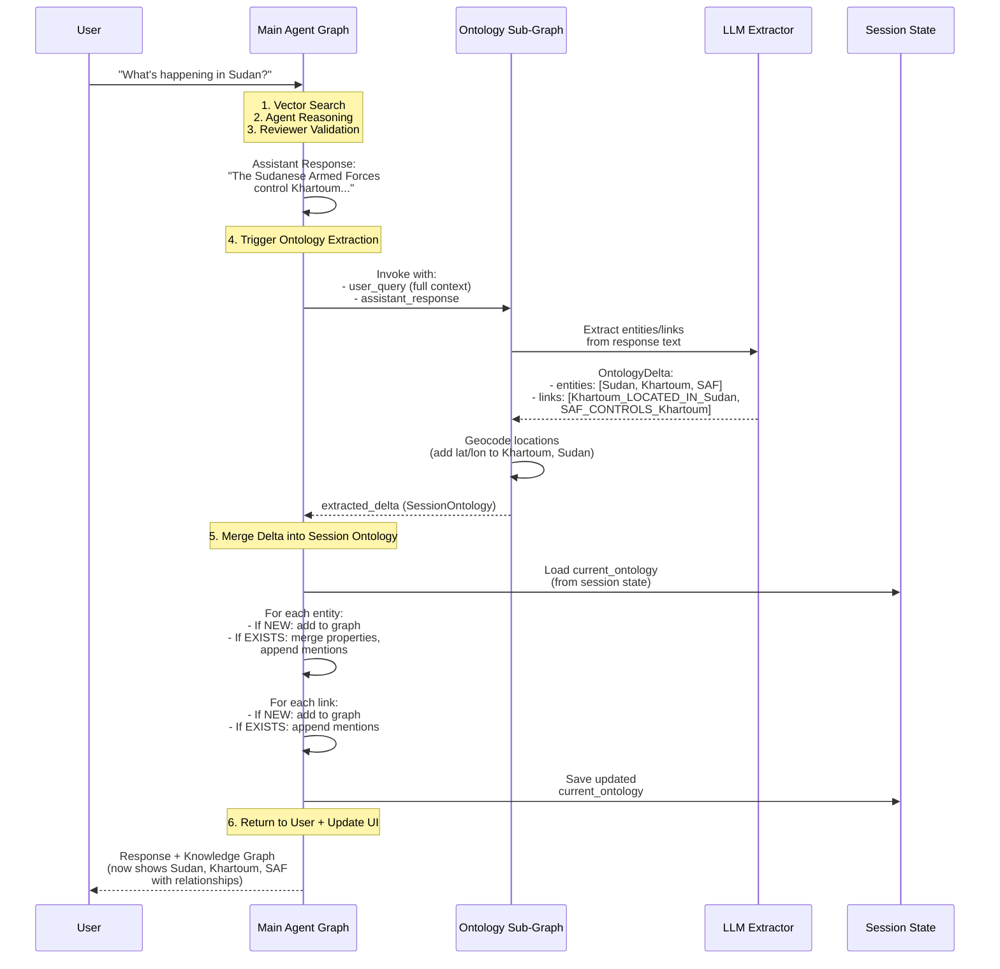

# Ontology Update Mechanism

## Overview

The GeoVision Lab ontology system uses an **incremental, stateful accumulation approach** to build knowledge graphs during conversations. The ontology **does know its current state** and can intelligently merge new information with existing knowledge.

---

## Architecture

```
┌─────────────────────────────────────────────────────────────────┐
│                    Agent State (Session)                        │
│  ┌─────────────────────────────────────────────────────────┐   │
│  │  STATE_KEY_ONTOLOGY (Persistent Session Ontology)       │   │
│  │  ┌──────────────────┐  ┌──────────────────────────┐    │   │
│  │  │   Entities       │  │   Links                  │    │   │
│  │  │  {               │  │  {                       │    │   │
│  │  │    "kyiv": {...} │  │    "kyiv_located_in_     │    │   │
│  │  │    "ukraine":... │  │       ukraine": {...}    │    │   │
│  │  │  }               │  │  }                       │    │   │
│  │  └──────────────────┘  └──────────────────────────┘    │   │
│  └─────────────────────────────────────────────────────────┘   │
└─────────────────────────────────────────────────────────────────┘
                            ↑
                            │ Merge Into
                            │
┌─────────────────────────────────────────────────────────────────┐
│              Ontology Sub-Graph (Stateless Extraction)          │
│  ┌──────────────────────────────────────────────────────────┐  │
│  │  extract_ontology_node                                    │  │
│  │  1. LLM extracts entities + links from assistant response│  │
│  │  2. Geocodes locations (adds lat/lon)                    │  │
│  │  3. Returns SessionOntology delta (new entities/links)   │  │
│  └──────────────────────────────────────────────────────────┘  │
└─────────────────────────────────────────────────────────────────┘
```

---

## Key Design Principles

### 1. **Stateless Extraction, Stateful Accumulation**

- **Ontology Sub-Graph**: Stateless - extracts ONLY from the current assistant response
- **Agent State**: Stateful - accumulates all entities/links across the entire session
- Each turn produces a **delta** (new knowledge), which is merged into the persistent session ontology

### 2. **Deterministic IDs Enable Smart Merging**

Entities and links use deterministic IDs, allowing the system to detect when new information refers to existing knowledge:

```python
# Entity ID: normalized name
ent_id = ext_ent.name.lower().strip()  # e.g., "kyiv", "volodymyr_zelensky"

# Link ID: source + relationship + target
link_id = f"{src_id}_{ext_link.relationship_type.lower()}_{tgt_id}"
# e.g., "kyiv_located_in_ukraine", "zelensky_leads_ukraine"
```

### 3. **Mentions Accumulation**

Every time an entity or relationship is mentioned, a new `Mention` object is added:

```python
class Mention(BaseModel):
    source_text: str              # Exact snippet where extracted
    extracted_at: datetime        # Timestamp
    confidence: float = 1.0       # Model confidence
```

This creates a **citation trail** showing all contexts where an entity/relationship appeared.

---

## Merge Logic (Step-by-Step)

### Entity Merging

Located in: `app/agents/graph.py::run_ontology_subgraph()`

```python
for k, v in entities.items():
    new_ent_data = v if isinstance(v, dict) else v.model_dump()
    
    if k not in current_ontology["entities"]:
        # NEW ENTITY: Add to graph
        current_ontology["entities"][k] = new_ent_data
    else:
        # EXISTING ENTITY: Merge intelligently
        existing = current_ontology["entities"][k]
        
        # 1. Add new mentions (accumulate all references)
        if "mentions" in new_ent_data:
            existing.setdefault("mentions", []).extend(new_ent_data["mentions"])
        
        # 2. Merge properties (new non-null values update existing)
        if "properties" in new_ent_data:
            for p_k, p_v in new_ent_data["properties"].items():
                if p_v is not None:
                    existing.setdefault("properties", {})[p_k] = p_v
```

**Example Scenario:**

```
Turn 1:
User: "What's happening in Kyiv?"
Assistant: "Kyiv is the capital of Ukraine. President Zelensky leads the country."

Extracted:
- Entity: "kyiv" (Location) → {lat: 50.4501, lon: 30.5234, country: "Ukraine"}
- Entity: "ukraine" (Location)
- Entity: "zelensky" (Person)
- Link: "kyiv_located_in_ukraine"
- Link: "zelensky_leads_ukraine"

Turn 2:
User: "Tell me more about Kyiv's location"
Assistant: "Kyiv is located in northern Ukraine, on the Dnieper River."

Extracted:
- Entity: "kyiv" (Location) → {display_name: "Kyiv, Ukraine"}
- Entity: "ukraine" (Location)
- Link: "kyiv_located_in_ukraine" (NEW MENTION)

Merged Result:
- Entity: "kyiv" 
  - properties: {lat: 50.4501, lon: 30.5234, country: "Ukraine", display_name: "Kyiv, Ukraine"}
  - mentions: [
      {source_text: "Kyiv is the capital of Ukraine", extracted_at: T1},
      {source_text: "Kyiv is located in northern Ukraine", extracted_at: T2}
    ]
- Link: "kyiv_located_in_ukraine"
  - mentions: [
      {source_text: "Kyiv is the capital of Ukraine", extracted_at: T1},
      {source_text: "Kyiv is located in northern Ukraine", extracted_at: T2}
    ]
```

### Link Merging

```python
for k, v in links.items():
    new_link_data = v if isinstance(v, dict) else v.model_dump()
    
    if k not in current_ontology["links"]:
        # NEW LINK: Add to graph
        current_ontology["links"][k] = new_link_data
    else:
        # EXISTING LINK: Append new mentions
        existing_link = current_ontology["links"][k]
        if "mentions" in new_link_data:
            existing_link.setdefault("mentions", []).extend(new_link_data["mentions"])
```

---

## Full Flow Diagram



---

## What the Ontology Extractor Knows

### ✅ **Does Know:**
1. **Full Conversation Context**: Receives complete conversation history (all turns) via `user_query` field
2. **Current Assistant Response**: The validated response to extract from
3. **Predefined + Discoverable Relations**: Can use 200+ predefined relation types OR discover new ones based on text

### ❌ **Does NOT Know:**
1. **Previous Ontology State**: The extractor LLM does NOT see the existing ontology graph
2. **Previously Extracted Entities**: Cannot check if "Khartoum" was already extracted in Turn 1
3. **Accumulated Knowledge**: Each extraction is stateless - only sees current text

### 🔄 **How State is Managed:**

The **merge logic** in `run_ontology_subgraph()` (in `app/agents/graph.py`) handles state:

1. **LLM Extraction**: Stateless - extracts from current response only
2. **Merge Process**: Stateful - compares extracted IDs against session ontology
3. **Deterministic Matching**: Uses normalized IDs to detect duplicates
4. **Intelligent Merging**: Combines properties and accumulates mentions

---

## Example: Multi-Turn Accumulation

### Turn 1
```
User: "What's the situation in Ukraine?"
Assistant: "Russia is in conflict with Ukraine. Russian forces target Kyiv."

Extracted:
- Entities: Russia, Ukraine, Kyiv, Russian_Forces
- Links: russia_conflict_with_ukraine, russian_forces_targets_kyiv, kyiv_located_in_ukraine
```

### Turn 2
```
User: "Who leads Ukraine?"
Assistant: "President Volodymyr Zelensky leads Ukraine. He is affiliated with NATO."

Extracted:
- Entities: Volodymyr_Zelensky, Ukraine, NATO
- Links: zelensky_leads_ukraine, zelensky_affiliated_with_nato

Merged Ontology (accumulated):
- Entities: Russia, Ukraine, Kyiv, Russian_Forces, Volodymyr_Zelensky, NATO (6 total)
- Links: 
  - russia_conflict_with_ukraine
  - russian_forces_targets_kyiv
  - kyiv_located_in_ukraine
  - zelensky_leads_ukraine
  - zelensky_affiliated_with_nato
  (5 total)
```

### Turn 3
```
User: "Where is Kyiv exactly?"
Assistant: "Kyiv is the capital city of Ukraine, located in the northern part of the country."

Extracted:
- Entities: Kyiv, Ukraine (already exist)
- Links: kyiv_located_in_ukraine (already exists)

Merged Ontology (updated):
- Entity "kyiv":
  - mentions: NOW HAS 2 entries (Turn 1 + Turn 3)
  - properties: Enhanced with more location details
- Link "kyiv_located_in_ukraine":
  - mentions: NOW HAS 2 entries (Turn 1 + Turn 3)
```

---

## Implementation Details

### File Locations

| Component | File | Function |
|-----------|------|----------|
| **Ontology Models** | `app/models/ontology.py` | `SessionOntology`, `OntologyEntity`, `OntologyLink`, `Mention` |
| **Extractor Service** | `app/services/ontology_extractor.py` | `OntologyExtractorService.extract()` |
| **Sub-Graph** | `app/agents/ontology_subgraph.py` | `extract_ontology_node()` |
| **Merge Logic** | `app/agents/graph.py` | `run_ontology_subgraph()` |
| **Full Context Builder** | `app/agents/graph.py` | Conversation history assembly |

### Key Code Snippets

**Full Context Building** (Turn-by-turn conversation history):
```python
# Build full conversation context from ALL messages
user_msgs = [m for m in state[STATE_KEY_MESSAGES] if isinstance(m, HumanMessage)]
assistant_msgs = [m for m in state[STATE_KEY_MESSAGES] if hasattr(m, "content") and not isinstance(m, HumanMessage)]

full_context_parts = []
for i, (user_msg, assistant_msg) in enumerate(zip(user_msgs, assistant_msgs), 1):
    full_context_parts.append(f"Turn {i}:\nUser: {user_content}\nAssistant: {assistant_content}")

# Include current query if no response yet
if len(user_msgs) > len(assistant_msgs):
    full_context_parts.append(f"Current Query:\nUser: {user_content}")

full_context = "\n\n".join(full_context_parts)
```

**Deterministic ID Generation**:
```python
# Entity ID
ent_id = ext_ent.name.lower().strip()

# Link ID
link_id = f"{src_id}_{ext_link.relationship_type.lower()}_{tgt_id}"
# Example: "kyiv_located_in_ukraine"
```

**Property Merge** (New info updates existing):
```python
if "properties" in new_ent_data:
    for p_k, p_v in new_ent_data["properties"].items():
        if p_v is not None:
            existing.setdefault("properties", {})[p_k] = p_v
```

---

## Benefits of This Design

### ✅ **Advantages**

1. **Accumulative Knowledge**: Graph grows richer with each turn
2. **Citation Trail**: Every entity/link tracks all mentions with timestamps
3. **Property Enrichment**: Later mentions can add missing properties (e.g., geocoding)
4. **No Duplicate Entities**: Deterministic IDs prevent "Kyiv" appearing twice
5. **Stateless Extraction**: LLM doesn't need to reason about previous state
6. **Scalable**: Each turn only processes new text, not entire history

### ⚠️ **Limitations**

1. **Session-Only**: Ontology resets when session ends (not persisted across sessions)
2. **No Contradiction Detection**: If Turn 1 says "Kyiv is in Ukraine" and Turn 5 says "Kyiv is in Russia", both are stored
3. **LLM Context Limits**: Full conversation history may exceed context window in very long conversations
4. **No Entity Resolution**: "Volodymyr Zelensky" and "President Zelensky" become separate entities

---

## Future Enhancements

Potential improvements to the ontology system:

1. **Cross-Session Persistence**: Save ontology to database for long-term memory
2. **Contradiction Detection**: Flag conflicting information for reviewer validation
3. **Entity Resolution**: Use LLM to detect when different names refer to same entity
4. **Ontology Pruning**: Remove low-confidence or outdated mentions
5. **Temporal Reasoning**: Track when relationships change over time (e.g., "controlled_by" changes hands)
6. **Graph Embeddings**: Enable semantic search over the ontology itself

---

## Testing

To observe the ontology accumulation in action:

```python
# In a test or debug session
from app.agents.graph import get_graph

graph = get_graph()

# Turn 1
result1 = graph.invoke({
    "messages": [HumanMessage(content="What's happening in Ukraine?")],
    "vector_search_results": ""
})
print(f"Turn 1 Entities: {len(result1['ontology']['entities'])}")

# Turn 2 (simulate conversation continuation)
result2 = graph.invoke({
    "messages": [
        HumanMessage(content="What's happening in Ukraine?"),
        AIMessage(content="Russia is in conflict with Ukraine..."),
        HumanMessage(content="Who leads Ukraine?")
    ],
    "vector_search_results": "",
    "ontology": result1['ontology']  # Pass previous state
})
print(f"Turn 2 Entities: {len(result2['ontology']['entities'])}")
# Should show accumulated entities from both turns
```

---

## Summary

The ontology system uses a **delta extraction + stateful merge** pattern:

1. **Extract**: LLM extracts entities/links from current response (stateless)
2. **Geocode**: Locations get lat/lon coordinates
3. **Merge**: Compare IDs against session ontology, merge intelligently
4. **Accumulate**: Properties update, mentions append, new items added
5. **Persist**: Updated ontology stored in session state for next turn

This design provides **accumulative intelligence** while keeping the LLM extraction simple and stateless.
