# Ontology System

> **Related Documentation:**
> - [Agent Workflow](agent_workflow.md) - Agent orchestration and workflow
> - [Technology Choices](technology.md) - Tech stack rationale
> - [Debugging Guide](debugging.md) - Troubleshooting common issues

---

## Overview

The GeoVision Lab Ontology System automatically extracts and maintains a structured knowledge graph from geopolitical intelligence conversations. It identifies entities (people, locations, organizations, events, etc.) and their relationships, building a cumulative intelligence database across the session.

### Key Features

- **Automatic Extraction** - Runs after every approved response without manual triggering
- **Multi-Entity Support** - Extracts 7 entity types: Location, Person, Organization, Event, Asset, Document, Concept
- **Relationship Mapping** - Identifies semantic relationships between entities (LOCATED_IN, AFFILIATED_WITH, SUPPORTS, TARGETS, etc.)
- **Location Geocoding** - Automatically geocodes location entities via Nominatim API
- **Two-Pass Gap Resolution** - Detects and recovers missing entity references through targeted re-extraction
- **Provenance Tracking** - Every entity and link preserves the source text (mention) for auditability
- **Session Accumulation** - Knowledge graph grows throughout the conversation, merging duplicates

---

## Architecture

```mermaid
%%{init: {'theme': 'dark'}}%%
flowchart TB
    subgraph Main["Main Agent Flow"]
        RESP["Approved Response Text<br/>from QA Reviewer"]
    end

    subgraph OntologySubgraph["ONTOLOGY_EXTRACTOR SUBGRAPH"]
        direction TB
        Extract["extract_ontology<br/>Extract entities & links<br/>Identify gaps"]
        
        Extract --> Detect["detect_gaps<br/>Check for missing<br/>entity references"]
        
        Detect --> Check{Gap<br/>entities<br/>found?}
        
        Check -->|Yes| GapExtract["extract_gap_entities<br/>Targeted LLM extraction<br/>for missing entities only"]
        Check -->|No| Merge
        
        GapExtract --> Merge["merge_and_finalize<br/>- Create entities with UUIDs<br/>- Process all links<br/>- Skip unresolvable"]
    end

    subgraph Store["Storage Layer"]
        Merge --> SessionOntology[("Session Ontology<br/>MongoDB Storage")]
    end

    RESP --> Extract
    SessionOntology --> UI["Knowledge Graph UI"]
    
    style OntologySubgraph fill:#1a1a2e,stroke:#5a3a8a,stroke-width:2px,stroke-dasharray: 5 5
```



---

## Ontology Sub-Graph Architecture

The ontology extraction runs as a LangGraph sub-graph with a two-pass gap resolution strategy.

### Complete Sub-Graph Flow

```mermaid
%%{init: {'theme': 'dark'}}%%
flowchart TD
    Start([Start]) --> Extract["extract_ontology_node<br/>PASS 1: Initial Extraction"]
    
    Extract --> Parse["Parse Entities + Links"]
    Parse --> ProcessEnt["Process Entities<br/>- Generate UUIDs<br/>- Geocode Locations<br/>- Build Name to UUID Map"]
    ProcessEnt --> IdentifyGaps["Identify Gap Entities<br/>Links reference missing entities"]
    
    IdentifyGaps --> Detect["detect_gaps_node<br/>Route based on gaps"]
    
    Detect --> HasGaps{"Gap<br/>entities<br/>found?"}
    
    HasGaps -->|Yes| GapExtract["extract_gap_entities_node<br/>PASS 2: Gap Resolution<br/>- Targeted LLM prompt<br/>- Extract ONLY missing entities<br/>- No link extraction"]
    HasGaps -->|No| Merge
    
    GapExtract --> Merge["merge_and_finalize_node<br/>Finalization<br/>- Merge gap entities<br/>- Process pending links<br/>- Resolve UUIDs<br/>- Skip unresolvable links"]
    
    Merge --> LinksOK{"All links<br/>resolvable?"}
    LinksOK -->|No - Skip| LogHallucinated["Log as hallucinated<br/>relationship"]
    LinksOK -->|Yes| CreateLink["Create link<br/>with UUIDs"]
    
    LogHallucinated --> End([End])
    CreateLink --> End
    
    style Extract fill:#2e1a3a,stroke:#5a3a6a
    style GapExtract fill:#2e1a3a,stroke:#5a3a6a
    style Merge fill:#2e1a3a,stroke:#5a3a6a
    style Detect fill:#1a2e3a,stroke:#3a5a6a
```



### Node Descriptions

#### extract_ontology_node (Pass 1)

**Purpose:** Initial extraction of entities and links from the assistant response.

**Process:**
1. Call LLM extractor with structured output prompt
2. Process entities:
   - Generate UUID for each entity
   - Geocode Location entities via Nominatim API
   - Store in session delta with mentions
   - Build name-to-UUID mapping
3. Collect links (defer processing until after gap resolution)
4. Identify gap entities (referenced in links but not extracted)
5. Output: session_delta, gap_entity_names, pending_links

**Output State:**
```python
{
    "extracted_delta": SessionOntology,  # Entities created
    "gap_entity_names": ["Allies", "Axis powers"],  # Missing entities
    "pending_links": [...]  # Links waiting for resolution
}
```

#### detect_gaps_node

**Purpose:** Conditional router that determines whether gap extraction is needed.

**Process:**
1. Check if gap_entity_names is empty
2. Route to extract_gap_entities if gaps exist
3. Route to merge_and_finalize if no gaps

**Routing Logic:**
```python
def route_after_gap_detection(state):
    if state.get("gap_entity_names"):
        return "extract_gap_entities"
    else:
        return "merge_and_finalize"
```

#### extract_gap_entities_node (Pass 2)

**Purpose:** Targeted extraction of only the missing gap entities.

**Process:**
1. Receive gap_entity_names from Pass 1
2. Invoke specialized LLM prompt:
   - Lists missing entity names
   - Requests ONLY those entities (no links)
   - Asks for proper type classification
3. Parse and validate extracted entities
4. Output: gap_entities_raw (list of entity dicts)

**Gap Extraction Prompt:**
```
You are repairing a knowledge graph extraction.

The following entities were referenced in relationships but were NOT extracted:
- "Allies"
- "Axis powers"

Your task: Extract ONLY these missing entities from the text below.
For each missing entity:
1. Find where it appears in the text
2. Determine its correct type (Organization, Concept, Event, etc.)
3. Extract the context where it's mentioned

Do NOT extract links. Do NOT extract other entities.
Focus only on the missing entities listed above.
```

#### merge_and_finalize_node

**Purpose:** Merge gap entities and process all pending links.

**Process:**
1. Process gap entities:
   - Generate UUIDs
   - Add to session delta
   - Update name-to-UUID map
2. Process pending links:
   - Look up source/target UUIDs
   - Create link with UUIDs (if both exist)
   - Skip and log unresolvable links
3. Output: final session_delta

**Link Resolution:**
```python
for link_data in pending_links:
    source_uuid = name_to_uuid.get(link_data["source"].lower())
    target_uuid = name_to_uuid.get(link_data["target"].lower())
    
    if source_uuid and target_uuid:
        # Create link
    else:
        # Skip and log as hallucinated
```

---

## Data Model

### Entity Types

| Type | Description | Example |
|------|-------------|---------|
| **Location** | Geographic places (countries, cities, regions) | "Ukraine", "Kyiv", "Middle East" |
| **Person** | Individual human beings | "Volodymyr Zelensky", "Vladimir Putin" |
| **Organization** | Groups, institutions, companies | "NATO", "United Nations", "Russian Armed Forces" |
| **Event** | Occurrences, incidents, conflicts | "Russo-Ukrainian War", "Annexation of Crimea" |
| **Asset** | Physical or digital resources | "F-16 Fighter Jets", "Patriot Missile System" |
| **Document** | Reports, treaties, agreements | "Budapest Memorandum", "UN Resolution 2623" |
| **Concept** | Abstract ideas, ideologies | "Democracy", "Nuclear Deterrence", "Sovereignty" |

### Entity Structure

```python
class OntologyEntity(BaseModel):
    uuid: UUID                               # UUID-based identity
    name: str                                # Display name
    type: str                                # Entity type from schema above
    properties: Dict[str, Any]               # Type-specific attributes
    mentions: List[Mention]                  # Source text references
    created_at: datetime                     # Creation timestamp
    created_by: str                          # Creator identifier
```

**Example Entity:**
```json
{
  "uuid": "550e8400-e29b-41d4-a716-446655440000",
  "type": "Location",
  "name": "Kyiv",
  "properties": {
    "lat": 50.4501,
    "lon": 30.5234,
    "country": "Ukraine",
    "display_name": "Kyiv, Ukraine"
  },
  "mentions": [
    {
      "source_text": "The conflict in Kyiv has escalated",
      "extracted_at": "2025-03-25T14:30:00Z",
      "confidence": 0.95
    }
  ],
  "created_by": "llm_extractor"
}
```

### Relationship Structure

```python
class OntologyLink(BaseModel):
    uuid: UUID                               # UUID-based identity
    source_uuid: UUID                        # Source entity UUID
    target_uuid: UUID                        # Target entity UUID
    type: str                                # Relationship type
    properties: Dict[str, Any]               # Optional metadata
    mentions: List[Mention]                  # Source text references
    created_at: datetime                     # Creation timestamp
    created_by: str                          # Creator identifier
```

**Example Relationship:**
```json
{
  "uuid": "75144852-67c3-44d7-9c4d-a137674df771",
  "source_uuid": "550e8400-e29b-41d4-a716-446655440000",
  "target_uuid": "660f9400-f39c-52e5-b827-557766550000",
  "type": "LOCATED_IN",
  "properties": {},
  "mentions": [
    {
      "source_text": "Kyiv is the capital of Ukraine",
      "extracted_at": "2025-03-25T14:30:00Z",
      "confidence": 0.98
    }
  ],
  "created_by": "llm_extractor"
}
```

### Common Relationship Types

| Relationship Category | Relationship Types | Direction | Example |
|-----------------------|-------------------|-----------|---------|
| **Spatial** | LOCATED_IN, STATIONED_IN, OPERATES_IN, HEADQUARTERED_IN, BRANCH_IN, ORIGINATES_FROM, DEPLOYS_TO | Entity to Location | "Kyiv" to "Ukraine" |
| **Organizational** | AFFILIATED_WITH, PART_OF, LEADS, COMMANDS, SUBORDINATE_TO, REPORTS_TO, REPRESENTS, SPEAKS_FOR, FOUNDED, ESTABLISHED, DISSOLVED | Person/Org to Organization | "Zelensky" to "Ukraine" |
| **Political/Military** | SUPPORTS, TARGETS, CONFLICT_WITH, ATTACKED, DEFENDS, ALLIES_WITH, HOSTILE_TO, SANCTIONS, EMBARGOES, ARMS, TRAINS, FUNDS | Entity to Entity | "United States" to "Ukraine" |
| **Territorial** | OCCUPIES, CONTROLS, LIBERATES, CAPTURES, SEIZES, RECAPTURES, OVERRUNS, FORTIFIES, BLOCKADES | Entity to Location | "Russian Forces" to "Crimea" |
| **Diplomatic** | NEGOTIATES_WITH, MET_WITH, VISITED, SIGNATORY_TO, RATIFIES, VIOLATES, WITHDRAWS_FROM, REJOINS, MEDIATES, ARBITRATES | Entity to Entity/Document | "Russia" to "Budapest Memorandum" |
| **Informational** | MENTIONS, MENTIONED_IN, REPORTS, INVESTIGATES, CONFIRMS, DENIES, CLAIMS, ALLEGES, ACCUSES_OF | Document/Entity to Entity | "UN Report" to "Human Rights Violations" |
| **Legal/Judicial** | INVESTIGATES, INDICTS, CHARGES, PROSECUTES, ARRESTS, DETAINS, RELEASES, PARDONS, EXTRADITES, SANCTIONED_BY | Entity to Entity | "ICC" to "War Criminals" |
| **Economic** | OWNS, ACQUIRES, MERGES_WITH, PARTNERS_WITH, FUNDS, SPONSORS, BOYCOTTS, IMPOSES_TARIFFS_ON, GRANTS_AID_TO | Entity to Entity | "Company A" to "Subsidiary B" |
| **Generic** | USES, RELATED_TO, PARTICIPATED_IN, COLLABORATES_WITH, COORDINATES_WITH, INFLUENCED_BY, DERIVED_FROM | Entity to Entity | Various contexts |

**Note:** The relationship types listed above are predefined examples, but the ontology extractor is designed to discover and use additional relationship types that accurately capture semantic connections in the text. The system uses CAPS_SNAKE_CASE format for all relationship types.

---

## LLM Extraction Prompt

The ontology extractor uses structured prompting to ensure consistent JSON output:

```
System Prompt:
You are an expert Intelligence Analyst extracting Entities and Relationships
into a strict JSON Knowledge Graph.

You must extract the following Entity types:
Location, Person, Organization, Event, Asset, Document, Concept.

You must extract Links between them with a descriptive relationship_type
(if any exist).

Your output MUST be a valid JSON object matching this schema:
{
  "entities": [
    { "name": "...", "type": "Location", "context": "exact text from source" }
  ],
  "links": [
    { "source_entity_name": "...", "target_entity_name": "...",
      "relationship_type": "LOCATED_IN", "context": "exact text" }
  ]
}

IMPORTANT: You MUST extract all relevant entities EVEN IF there are no links
between them! It is perfectly fine to return an empty 'links' array, but you
must still extract the entities.

Do not add markdown formatting or conversational text, only output the JSON.
```

---

## Gap Resolution Strategy

The two-pass extraction with gap resolution addresses the problem of links referencing entities that weren't extracted in the initial pass.

### Problem Example

**Input Text:**
```
The Allies and Axis powers were the two main opposing military alliances.
The Allies included United States, United Kingdom, and Soviet Union.
The Axis powers included Nazi Germany, Empire of Japan, and Kingdom of Italy.
```

**Pass 1 Extraction (Incomplete):**
- Entities: United States, United Kingdom, Soviet Union, Nazi Germany, Empire of Japan, Kingdom of Italy
- Links: (United States) -[PART_OF]-> (Allies), (Nazi Germany) -[PART_OF]-> (Axis powers)
- **Problem:** "Allies" and "Axis powers" referenced in links but not extracted as entities

**Gap Detection:**
- Missing entities: ["Allies", "Axis powers"]

**Pass 2 Gap Extraction:**
- Entities: Allies (Organization), Axis powers (Organization)

**Final Result:**
- All 8 entities extracted
- All links resolvable with UUIDs

### Benefits

1. **Referential Integrity** - All link references resolve to actual entities
2. **LLM-Driven Typing** - Gap entities get proper type classification from LLM
3. **Minimal Overhead** - Second pass only runs when gaps detected
4. **Audit Trail** - Clear logging of gap detection and resolution
5. **Handles Hallucinations** - Unresolvable links logged and skipped gracefully

---

## Integration with Main Agent Graph

The ontology extractor is a sub-graph node in the main LangGraph workflow:

```python
# From app/agents/graph.py

def get_graph():
    workflow = StateGraph(AgentState)

    # Add nodes
    workflow.add_node(NODE_VECTOR_SEARCH, vector_search_node)
    workflow.add_node(NODE_AGENT, call_model)
    workflow.add_node(NODE_TOOLS, ToolNode(tools))
    workflow.add_node(NODE_REVIEWER, review_response)
    workflow.add_node(NODE_ONTOLOGY_EXTRACTOR, run_ontology_subgraph)

    # Define edges
    workflow.set_entry_point(NODE_VECTOR_SEARCH)
    workflow.add_edge(NODE_VECTOR_SEARCH, NODE_AGENT)
    workflow.add_conditional_edges(NODE_AGENT, should_continue)
    workflow.add_edge(NODE_TOOLS, NODE_AGENT)
    workflow.add_conditional_edges(NODE_REVIEWER, check_validation)
    workflow.add_edge(NODE_ONTOLOGY_EXTRACTOR, "__end__")

    return workflow.compile(checkpointer=checkpointer)
```

### State Flow

```
User Query
  -> vector_search_node (inject archival results)
  -> agent_node (reasoning + tool calls)
  -> reviewer_node (QA validation)
  -> ontology_extractor_node (sub-graph execution)
      -> extract_ontology (Pass 1)
      -> detect_gaps (routing)
      -> extract_gap_entities (Pass 2, if needed)
      -> merge_and_finalize (finalization)
  -> __end__ (return response + updated ontology)
```

---

## Streaming Events

The ontology extraction emits streaming events for real-time UI updates:

```python
# Event type: ontology_updated
{
  "type": "ontology_updated",
  "tool": "ontology_subgraph",
  "summary": "Graph updated: 5 entities, 3 relationships",
  "ontology": {
    "entities": {...},
    "links": {...}
  }
}
```

**Frontend Handling:**
```javascript
if (event.type === 'ontology_updated') {
  const { ontology } = event;
  updateKnowledgeGraphPanel(ontology);
  renderEntityNodes(ontology.entities);
  renderRelationshipEdges(ontology.links);
}
```

---

## Debugging

### Inspect Ontology State

```python
# In a debugging script
from app.agents.graph import process_query

result = process_query("Tell me about the conflict in Ukraine", "debug-thread")
ontology = result.get("ontology", {})

print(f"Entities: {len(ontology.get('entities', {}))}")
print(f"Links: {len(ontology.get('links', {}))}")

for ent_id, entity in ontology.get("entities", {}).items():
    print(f"  - {entity['type']}: {entity['name']}")
    if entity.get("properties", {}).get("lat"):
        print(f"    Location: ({entity['properties']['lat']}, {entity['properties']['lon']})")
```

### Log Extraction

```bash
# Enable DEBUG logging
docker compose logs -f geovision-api | grep ONTOLOGY
```

**Expected Log Output:**
```
[ONTOLOGY_SUBGRAPH] Pass 1: Extracting entities and links
[ONTOLOGY_EXTRACTOR] Starting extraction...
[ONTOLOGY_SUBGRAPH] Extractor returned 25 entities and 26 links
[ONTOLOGY_SUBGRAPH] Gap entities detected: 2
[ONTOLOGY_SUBGRAPH] Gap entity names: ['Allies', 'Axis powers']
[ONTOLOGY_SUBGRAPH] Pass 2: Extracting 2 gap entities
[ONTOLOGY_EXTRACTOR] Gap extraction successful: 2 entities recovered
[ONTOLOGY_SUBGRAPH] Finalization: Merging entities and processing links
[ONTOLOGY_SUBGRAPH] Total entities: 27
[ONTOLOGY_SUBGRAPH] Links created: 26
```

### Common Issues

| Issue | Symptom | Solution |
|-------|---------|----------|
| **No entities extracted** | Ontology empty after response | Check LLM extractor prompt; ensure response contains named entities |
| **Duplicate entities** | Same entity appears multiple times | UUID-based identity should prevent this; check merge logic |
| **Geocoding fails** | Location entities missing coordinates | Nominatim API rate limiting or network issue |
| **Gap extraction fails** | Links still skipped after Pass 2 | Entity may not exist in text (hallucinated link); check logs |
| **JSON parsing error** | Extraction returns None | LLM output malformed; check structured output fallback |

---

## Future Enhancements

### 1. Persistent Ontology Storage

Currently the ontology is session-scoped. Future enhancement:

```python
# Persist to MongoDB after each session
async def persist_ontology_to_mongodb(ontology: SessionOntology, thread_id: str):
    await db.ontologies.update_one(
        {"thread_id": thread_id},
        {"$set": {"entities": ontology.entities, "links": ontology.links}},
        upsert=True
    )
```

### 2. Cross-Session Entity Resolution

Improve entity deduplication across sessions:

```python
# Use fuzzy matching + embeddings for entity resolution
def resolve_entity(new_entity: OntologyEntity, existing_entities: Dict) -> Optional[str]:
    # Compare name similarity, type, and context
    # Return existing ID if match found, else None
```

### 3. Ontology Query API

Enable querying the knowledge graph:

```python
@app.get("/api/ontology/entities")
async def get_entities(type: Optional[str] = None):
    """Retrieve all entities, optionally filtered by type."""

@app.get("/api/ontology/entity/{entity_id}")
async def get_entity(entity_id: str):
    """Get a specific entity with all relationships."""

@app.get("/api/ontology/entity/{entity_id}/relationships")
async def get_entity_relationships(entity_id: str):
    """Get all relationships for an entity."""
```

### 4. Hierarchical Entity Types

Support sub-typing for better categorization:

```python
class LocationEntity(OntologyEntity):
    subtype: Literal["Country", "City", "Region", "Landmark"]

class PersonEntity(OntologyEntity):
    subtype: Literal["Politician", "Military_Leader", "Diplomat"]
```

### 5. Entity Deduplication

Detect and merge near-duplicate entities (e.g., "Empire of Japan" vs "Imperial Japan"):

```python
# Fuzzy matching on entity names
from difflib import SequenceMatcher

def are_duplicates(name1: str, name2: str, type1: str, type2: str) -> bool:
    if type1 != type2:
        return False
    similarity = SequenceMatcher(None, name1.lower(), name2.lower()).ratio()
    return similarity > 0.85
```

---

## References

- [LangGraph StateGraph](https://langchain-ai.github.io/langgraph/how-tos/state-graph/)
- [LangGraph Subgraphs](https://langchain-ai.github.io/langgraph/how-tos/subgraph/)
- [Nominatim Geocoding API](https://nominatim.org/release-docs/latest/api/Overview/)
- [Ontology (Knowledge Graph) Design Patterns](https://en.wikipedia.org/wiki/Ontology_(information_science))
