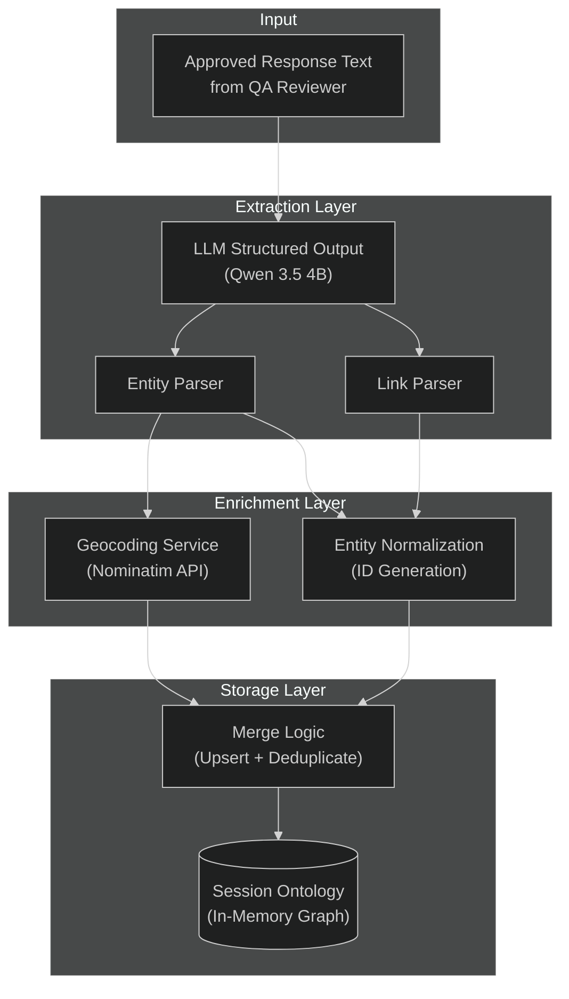
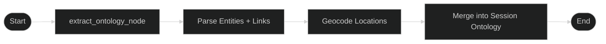

# Ontology System

> **Related Documentation:**
> - [Agent Workflow](agent_workflow.md) — Agent orchestration and workflow
> - [Technology Choices](technology.md) — Tech stack rationale
> - [Debugging Guide](debugging.md) — Troubleshooting common issues

---

## Overview

The GeoVision Lab Ontology System automatically extracts and maintains a structured knowledge graph from geopolitical intelligence conversations. It identifies entities (people, locations, organizations, events, etc.) and their relationships, building a cumulative intelligence database across the session.

### Key Features

- **Automatic Extraction** — Runs after every approved response without manual triggering
- **Multi-Entity Support** — Extracts 7 entity types: Location, Person, Organization, Event, Asset, Document, Concept
- **Relationship Mapping** — Identifies semantic relationships between entities (LOCATED_IN, AFFILIATED_WITH, SUPPORTS, TARGETS, etc.)
- **Location Geocoding** — Automatically geocodes location entities via Nominatim API
- **Provenance Tracking** — Every entity and link preserves the source text (mention) for auditability
- **Session Accumulation** — Knowledge graph grows throughout the conversation, merging duplicates

---

## Architecture



---

## Data Model

### Entity Types

| Type | Description | Example |
|------|-------------|---------|
| **Location** | Geographic places (countries, cities, regions) | "Ukraine", "Kyiv", "Middle East" |
| **Person** | Individual human beings | "Volodymyr Zelensky", "Vladimir Putin" |
| **Organization** | Groups, institutions, companies | "NATO", "United Nations", "Russian Armed Forces" |
| **Event** | Occurrences, incidents, conflicts | "Russo-Ukrainian War", "Annexation of Crimea" |
| **Asset** | Physical or digital resources | "F-16 Fighter Jets", "Patriot Missile System" |
| **Document** | Reports, treaties, agreements | "Budapest Memorandum", "UN Resolution 2623" |
| **Concept** | Abstract ideas, ideologies | "Democracy", "Nuclear Deterrence", "Sovereignty" |

### Entity Structure

```python
class OntologyEntity(BaseModel):
    id: str                                # Normalized ID (e.g., "volodymyr_zelensky")
    type: str                              # Entity type from schema above
    name: str                              # Display name
    properties: Dict[str, Any]             # Type-specific attributes
    mentions: List[Mention]                # Source text references
```

**Example Entity:**
```json
{
  "id": "kyiv",
  "type": "Location",
  "name": "Kyiv",
  "properties": {
    "lat": 50.4501,
    "lon": 30.5234,
    "country": "Ukraine",
    "display_name": "Kyiv, Ukraine"
  },
  "mentions": [
    {
      "source_text": "The conflict in Kyiv has escalated",
      "extracted_at": "2025-03-25T14:30:00Z",
      "confidence": 0.95
    }
  ]
}
```

### Relationship Structure

```python
class OntologyLink(BaseModel):
    id: str                                # Composite ID: "{source}_{type}_{target}"
    source_id: str                         # Source entity ID
    target_id: str                         # Target entity ID
    type: str                              # Relationship type
    properties: Dict[str, Any]             # Optional metadata
    mentions: List[Mention]                # Source text references
```

**Example Relationship:**
```json
{
  "id": "kyiv_located_in_ukraine",
  "source_id": "kyiv",
  "target_id": "ukraine",
  "type": "LOCATED_IN",
  "properties": {},
  "mentions": [
    {
      "source_text": "Kyiv is the capital of Ukraine",
      "extracted_at": "2025-03-25T14:30:00Z",
      "confidence": 0.98
    }
  ]
}
```

### Common Relationship Types

| Relationship Category | Relationship Types | Direction | Example |
|-----------------------|-------------------|-----------|---------|
| **Spatial** | LOCATED_IN, STATIONED_IN, OPERATES_IN, HEADQUARTERED_IN, BRANCH_IN, ORIGINATES_FROM, DEPLOYS_TO | Entity → Location | "Kyiv" → "Ukraine" |
| **Organizational** | AFFILIATED_WITH, PART_OF, LEADS, COMMANDS, SUBORDINATE_TO, REPORTS_TO, REPRESENTS, SPEAKS_FOR, FOUNDED, ESTABLISHED, DISSOLVED | Person/Org → Organization | "Zelensky" → "Ukraine" |
| **Political/Military** | SUPPORTS, TARGETS, CONFLICT_WITH, ATTACKED, DEFENDS, ALLIES_WITH, HOSTILE_TO, SANCTIONS, EMBARGOES, ARMS, TRAINS, FUNDS | Entity → Entity | "United States" → "Ukraine" |
| **Territorial** | OCCUPIES, CONTROLS, LIBERATES, CAPTURES, SEIZES, RECAPTURES, OVERRUNS, FORTIFIES, BLOCKADES | Entity → Location | "Russian Forces" → "Crimea" |
| **Diplomatic** | NEGOTIATES_WITH, MET_WITH, VISITED, SIGNATORY_TO, RATIFIES, VIOLATES, WITHDRAWS_FROM, REJOINS, MEDIATES, ARBITRATES | Entity → Entity/Document | "Russia" → "Budapest Memorandum" |
| **Informational** | MENTIONS, MENTIONED_IN, REPORTS, INVESTIGATES, CONFIRMS, DENIES, CLAIMS, ALLEGES, ACCUSES_OF | Document/Entity → Entity | "UN Report" → "Human Rights Violations" |
| **Legal/Judicial** | INVESTIGATES, INDICTS, CHARGES, PROSECUTES, ARRESTS, DETAINS, RELEASES, PARDONS, EXTRADITES, SANCTIONED_BY | Entity → Entity | "ICC" → "War Criminals" |
| **Economic** | OWNS, ACQUIRES, MERGES_WITH, PARTNERS_WITH, FUNDS, SPONSORS, BOYCOTTS, IMPOSES_TARIFFS_ON, GRANTS_AID_TO | Entity → Entity | "Company A" → "Subsidiary B" |
| **Generic** | USES, RELATED_TO, PARTICIPATED_IN, COLLABORATES_WITH, COORDINATES_WITH, INFLUENCED_BY, DERIVED_FROM | Entity → Entity | Various contexts |

**Note:** The relationship types listed above are predefined examples, but the ontology extractor is designed to discover and use additional relationship types that accurately capture semantic connections in the text. The system uses CAPS_SNAKE_CASE format for all relationship types (e.g., `MARRIED_TO`, `SIBLING_OF`, `STUDIED_AT`).

---

## Ontology Sub-Graph

The ontology extraction runs as a LangGraph sub-graph with the following structure:



### Node Implementation

```python
def extract_ontology_node(state: OntologySubGraphState) -> Dict[str, Any]:
    """Extracts entities and links from the assistant response."""
    
    # 1. Get the response text
    assistant_response = state["assistant_response"]
    query = state["user_query"]
    
    # 2. Call LLM extractor with structured output
    extractor = get_ontology_extractor()
    delta = extractor.extract(text=assistant_response, query=query)
    
    # 3. Process entities
    for ext_ent in delta.entities:
        ent_id = ext_ent.name.lower().strip()
        
        # Geocode if location
        if ext_ent.type == "Location":
            candidates = loc_extractor.geocode_location(ext_ent.name)
            if candidates:
                best = candidates[0]
                properties["lat"] = best["lat"]
                properties["lon"] = best["lon"]
                properties["country"] = best.get("country", "")
        
        entity = OntologyEntity(
            id=ent_id,
            type=ext_ent.type,
            name=ext_ent.name,
            properties=properties,
            mentions=[Mention(source_text=ext_ent.context)]
        )
        session_delta.entities[ent_id] = entity
    
    # 4. Process links
    for ext_link in delta.links:
        src_id = ext_link.source_entity_name.lower().strip()
        tgt_id = ext_link.target_entity_name.lower().strip()
        link_id = f"{src_id}_{ext_link.relationship_type}_{tgt_id}"
        
        link = OntologyLink(
            id=link_id,
            source_id=src_id,
            target_id=tgt_id,
            type=ext_link.relationship_type,
            mentions=[Mention(source_text=ext_link.context)]
        )
        session_delta.links[link_id] = link
    
    return {"extracted_delta": session_delta}
```

---

## LLM Extraction Prompt

The ontology extractor uses structured prompting to ensure consistent JSON output:

```
System Prompt:
You are an expert Intelligence Analyst extracting Entities and Relationships 
into a strict JSON Knowledge Graph.

You must extract the following Entity types: 
Location, Person, Organization, Event, Asset, Document, Concept.

You must extract Links between them with a descriptive relationship_type 
(if any exist).

Your output MUST be a valid JSON object matching this schema:
{
  "entities": [
    { "name": "...", "type": "Location", "context": "exact text from source" }
  ],
  "links": [
    { "source_entity_name": "...", "target_entity_name": "...", 
      "relationship_type": "LOCATED_IN", "context": "exact text" }
  ]
}

IMPORTANT: You MUST extract all relevant entities EVEN IF there are no links 
between them! It is perfectly fine to return an empty 'links' array, but you 
must still extract the entities.

Do not add markdown formatting or conversational text, only output the JSON.
```

---

## Merge Strategy

When merging extracted entities and links into the session ontology:

### Entity Merging

```python
for k, v in entities.items():
    if k not in current_ontology["entities"]:
        # New entity - insert directly
        current_ontology["entities"][k] = v
    else:
        # Existing entity - merge
        existing = current_ontology["entities"][k]
        
        # Add new mentions (avoid duplicates)
        if "mentions" in v:
            for mention in v["mentions"]:
                if mention not in existing["mentions"]:
                    existing["mentions"].append(mention)
        
        # Merge properties (new info takes precedence)
        if "properties" in v:
            for p_k, p_v in v["properties"].items():
                if p_v is not None:
                    existing.setdefault("properties", {})[p_k] = p_v
```

### Link Merging

```python
for k, v in links.items():
    if k not in current_ontology["links"]:
        # New link - insert directly
        current_ontology["links"][k] = v
    else:
        # Existing link - append mentions
        existing_link = current_ontology["links"][k]
        if "mentions" in v:
            existing_link.setdefault("mentions", []).extend(v["mentions"])
```

---

## Integration with Main Agent Graph

The ontology extractor is a node in the main LangGraph workflow:

```python
# From app/agents/graph.py

def get_graph():
    workflow = StateGraph(AgentState)
    
    # Add nodes
    workflow.add_node(NODE_VECTOR_SEARCH, vector_search_node)
    workflow.add_node(NODE_AGENT, call_model)
    workflow.add_node(NODE_TOOLS, ToolNode(tools))
    workflow.add_node(NODE_REVIEWER, review_response)
    workflow.add_node(NODE_ONTOLOGY_EXTRACTOR, run_ontology_subgraph)
    
    # Define edges
    workflow.set_entry_point(NODE_VECTOR_SEARCH)
    workflow.add_edge(NODE_VECTOR_SEARCH, NODE_AGENT)
    workflow.add_conditional_edges(NODE_AGENT, should_continue)
    workflow.add_edge(NODE_TOOLS, NODE_AGENT)
    workflow.add_conditional_edges(NODE_REVIEWER, check_validation)
    workflow.add_edge(NODE_ONTOLOGY_EXTRACTOR, "__end__")
    
    return workflow.compile(checkpointer=checkpointer)
```

### State Flow

```
User Query 
  → vector_search_node (inject archival results)
  → agent_node (reasoning + tool calls)
  → reviewer_node (QA validation)
  → ontology_extractor_node (entity/link extraction)
  → __end__ (return response + updated ontology)
```

---

## Streaming Events

The ontology extraction emits streaming events for real-time UI updates:

```python
# Event type: ontology_updated
{
  "type": "ontology_updated",
  "tool": "ontology_subgraph",
  "summary": "Graph updated: 5 entities, 3 relationships",
  "ontology": {
    "entities": {...},
    "links": {...}
  }
}
```

**Frontend Handling:**
```javascript
if (event.type === 'ontology_updated') {
  const { ontology } = event;
  updateKnowledgeGraphPanel(ontology);
  renderEntityNodes(ontology.entities);
  renderRelationshipEdges(ontology.links);
}
```

---

## Debugging

### Inspect Ontology State

```python
# In a debugging script
from app.agents.graph import process_query

result = process_query("Tell me about the conflict in Ukraine", "debug-thread")
ontology = result.get("ontology", {})

print(f"Entities: {len(ontology.get('entities', {}))}")
print(f"Links: {len(ontology.get('links', {}))}")

for ent_id, entity in ontology.get("entities", {}).items():
    print(f"  - {entity['type']}: {entity['name']}")
    if entity.get("properties", {}).get("lat"):
        print(f"    Location: ({entity['properties']['lat']}, {entity['properties']['lon']})")
```

### Log Extraction

```bash
# Enable DEBUG logging
docker compose logs -f geovision-api | grep ONTOLOGY
```

**Expected Log Output:**
```
[ONTOLOGY_SUBGRAPH] Starting ontology processing sub-graph
[ONTOLOGY_EXTRACTOR] Starting extraction...
[ONTOLOGY_SUBGRAPH] Found 5 entities and 3 links
[ONTOLOGY_SUBGRAPH] Sub-graph complete: 12 entities accumulated.
```

### Common Issues

| Issue | Symptom | Solution |
|-------|---------|----------|
| **No entities extracted** | Ontology empty after response | Check LLM extractor prompt; ensure response contains named entities |
| **Duplicate entities** | Same entity appears multiple times | Entity ID normalization may be failing; check `ent_id = name.lower().strip()` |
| **Geocoding fails** | Location entities missing coordinates | Nominatim API rate limiting or network issue |
| **JSON parsing error** | Extraction returns None | LLM output malformed; check structured output fallback |

---

## Future Enhancements

### 1. Persistent Ontology Storage

Currently the ontology is session-scoped. Future enhancement:

```python
# Persist to MongoDB after each session
async def persist_ontology_to_mongodb(ontology: SessionOntology, thread_id: str):
    await db.ontologies.update_one(
        {"thread_id": thread_id},
        {"$set": {"entities": ontology.entities, "links": ontology.links}},
        upsert=True
    )
```

### 2. Cross-Session Entity Resolution

Improve entity deduplication across sessions:

```python
# Use fuzzy matching + embeddings for entity resolution
def resolve_entity(new_entity: OntologyEntity, existing_entities: Dict) -> Optional[str]:
    # Compare name similarity, type, and context
    # Return existing ID if match found, else None
```

### 3. Ontology Query API

Enable querying the knowledge graph:

```python
@app.get("/api/ontology/entities")
async def get_entities(type: Optional[str] = None):
    """Retrieve all entities, optionally filtered by type."""

@app.get("/api/ontology/entity/{entity_id}")
async def get_entity(entity_id: str):
    """Get a specific entity with all relationships."""

@app.get("/api/ontology/entity/{entity_id}/relationships")
async def get_entity_relationships(entity_id: str):
    """Get all relationships for an entity."""
```

### 4. Entity Disambiguation

Improve ID generation to handle同名 entities:

```python
# Current: ent_id = name.lower().strip()
# Improved: ent_id = f"{type}_{name.lower().replace(' ', '_')}"
# Example: "person_volodymyr_zelensky" vs "location_zelensky" (if a place had same name)
```

### 5. Hierarchical Entity Types

Support sub-typing for better categorization:

```python
class LocationEntity(OntologyEntity):
    subtype: Literal["Country", "City", "Region", "Landmark"]
    
class PersonEntity(OntologyEntity):
    subtype: Literal["Politician", "Military_Leader", "Diplomat"]
```

---

## References

- [LangGraph StateGraph](https://langchain-ai.github.io/langgraph/how-tos/state-graph/)
- [LangGraph Subgraphs](https://langchain-ai.github.io/langgraph/how-tos/subgraph/)
- [Nominatim Geocoding API](https://nominatim.org/release-docs/latest/api/Overview/)
- [Ontology (Knowledge Graph) Design Patterns](https://en.wikipedia.org/wiki/Ontology_(information_science))
