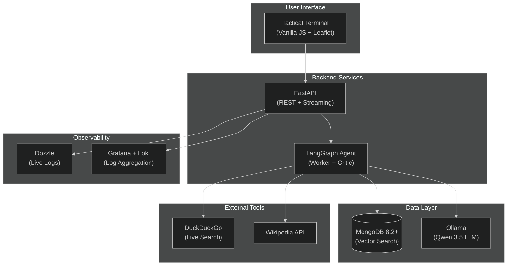

# Technology Choices & Rationale

This document details the technology stack decisions for GeoVision Lab, explaining why each tool was selected and what alternatives were considered.

---

## Architecture Overview



---

## Core Technology Decisions

### 1. MongoDB 8.2+ for Vector Search

**Decision**: Migrated from PostgreSQL/pgvector to MongoDB 8.2+ with native vector search.

#### Comparison Matrix

| Factor | PostgreSQL + pgvector | MongoDB 8.2+ Vector Search |
|--------|----------------------|---------------------------|
| **Setup Complexity** | Requires extension installation, HNSW index tuning | Native vector search with automatic index management |
| **Schema Flexibility** | Rigid schema, migrations needed for changes | Document-based, schemaless design |
| **Horizontal Scaling** | Complex sharding setup | Built-in sharding and replica sets |
| **Developer Experience** | SQL-based, requires ORM layer | JSON-native, intuitive for JavaScript/Python developers |
| **Vector Search Performance** | Good with HNSW, but requires manual tuning | Optimized `mongot` service with automatic candidate selection |
| **Cloud-Native** | Traditional RDBMS architecture | Designed for distributed, cloud-native deployments |

#### Key Decision Factors

1. **Simplified Operations**: MongoDB's vector search is built-in and managed through the same interface as regular queries
2. **No Migration Overhead**: Document structure adapts naturally to varying document lengths and metadata
3. **Future-Proof**: MongoDB's rapid iteration on AI/ML features ensures continued improvements
4. **Unified Data Model**: Store structured metadata alongside vectors without complex joins

#### Implementation Details

```python
# MongoDB vector search configuration
vector_index = {
    "name": "vector_index",
    "type": "vector",
    "definition": {
        "field": "embedding",
        "numDimensions": 384,
        "similarity": "cosine"
    }
}
```

---

### 2. Ollama for LLM Inference

**Decision**: Ollama as the local LLM runtime with switchable Qwen 3.5 models.

#### Why Ollama?

| Benefit | Description |
|---------|-------------|
| **Local-First** | Complete offline operation with no API keys or cloud dependencies |
| **Model Flexibility** | Easy switching between models (Qwen 3.5 9B/4B) without code changes |
| **Resource Efficiency** | Automatic GPU acceleration with fallback to CPU |
| **Simple Deployment** | Single container with built-in model management |
| **Open Source** | Full transparency and control over the inference stack |

#### Model Selection Matrix

| Model | Size | VRAM Required | Speed | Quality | Best Use Case |
|-------|------|---------------|-------|---------|---------------|
| **Qwen 3.5 9B** | 9 billion | ~6 GB | Slower | Highest | Complex analysis, detailed reports |
| **Qwen 3.5 4B** | 4 billion | ~3 GB | Balanced | High | Default — general purpose queries |

**Note**: The QA/Reviewer model remains fixed at Qwen 2.5:0.5b for consistent constraint checking.

---

### 3. LangGraph for Agent Architecture

**Decision**: LangGraph as the orchestration layer for multi-agent coordination.

#### Why LangGraph?

| Feature | Benefit |
|---------|---------|
| **Stateful Execution** | Built-in conversation memory through `MemorySaver` |
| **Graph-Based Flow** | Visual, predictable agent behavior with explicit state transitions |
| **Tool Integration** | Seamless binding of custom tools (vector search, web search) |
| **Human-in-the-Loop** | Support for review/approval steps (our QA Reviewer agent) |
| **Streaming Support** | Real-time token streaming for responsive UX |

#### Agent Architecture

```mermaid
%%{init: {'theme': 'dark'}}%%
stateDiagram-v2
    [*] --> UserInput
    UserInput --> Agent: Process Query
    Agent --> ShouldContinue{Has Tool Calls?}
    ShouldContinue -->|Yes| Tools: Execute Tools
    Tools --> Agent: Loop Back
    ShouldContinue -->|No| Reviewer: QA Check
    Reviewer --> OutputConstraints{Passes?}
    OutputConstraints -->|Yes| Response: Stream to User
    OutputConstraints -->|No| Agent: Revise
    Response --> [*]
```

See [AGENT_WORKFLOW.md](AGENT_WORKFLOW.md) for detailed workflow documentation.

---

### 4. all-MiniLM-L6-v2 for Embeddings

**Decision**: sentence-transformers/all-MiniLM-L6-v2 as the embedding model.

#### Model Specifications

| Property | Value |
|----------|-------|
| **Dimensions** | 384 |
| **Max Sequence Length** | 512 tokens |
| **Performance** | ~2800 tokens/second |
| **Model Size** | ~90 MB |

#### Why This Model?

1. **Compact Size**: 384 dimensions vs. 768+ for larger models — reduces storage and search latency
2. **Speed**: Fast embedding generation suitable for real-time ingestion
3. **Quality**: Strong semantic understanding for RAG applications
4. **Local Execution**: No API calls, runs entirely within Docker
5. **Proven Track Record**: Widely adopted in production RAG systems

#### Alternatives Considered

| Model | Dimensions | Pros | Cons |
|-------|------------|------|------|
| **all-MiniLM-L6-v2** | 384 | Fast, compact, good quality | Limited context window |
| **all-mpnet-base-v2** | 768 | Higher quality embeddings | 2x storage, slower search |
| **bge-small-en** | 384 | Competitive quality | Less community adoption |

---

### 5. Vanilla JS + Leaflet for Frontend

**Decision**: Zero-build frontend with vanilla JavaScript and Leaflet.js for mapping.

#### Bundle Size Comparison

| Framework | Bundle Size (gzipped) | Build Step Required |
|-----------|----------------------|---------------------|
| **Vanilla JS** | ~50 KB | ❌ No |
| React + Vite | ~150 KB | ✅ Yes |
| Vue + Vite | ~120 KB | ✅ Yes |
| Svelte | ~100 KB | ✅ Yes |

#### Why Vanilla JS?

1. **Zero Build Step**: No webpack, Vite, or npm complexity
2. **Lightweight**: ~50KB total vs. MBs for React/Vue bundles
3. **Leaflet Integration**: Best-in-class open-source mapping library
4. **Direct DOM Control**: Precise control over streaming updates
5. **Educational Value**: Clear, readable code for learning purposes

#### Font Optimization

Using **Rajdhani** (Google Fonts) for the tactical/cyberpunk aesthetic:
- Square, technical appearance
- Excellent readability at small sizes
- Multiple weights for hierarchy

---

### 6. Grafana + Loki for Observability

**Decision**: Open-source observability stack with Grafana, Loki, and Dozzle.

#### Stack Components

| Component | Purpose | Port |
|-----------|---------|------|
| **Grafana** | Dashboard visualization | 3000 |
| **Loki** | Log aggregation engine | 3100 |
| **Promtail** | Log shipper (collects from containers) | — |
| **Dozzle** | Real-time container log viewer | 9999 |

#### Why This Stack?

1. **Log Aggregation**: Centralized logging across all containers
2. **Real-Time Debugging**: Live tailing of container logs via Dozzle
3. **Cost-Effective**: Open-source alternative to Datadog/Splunk
4. **Query Language**: LogQL enables powerful log analysis
5. **Visual Dashboards**: Grafana provides professional visualization

#### LogQL Example

```logql
{container="geovision-api"} |= "ERROR" | json | level="error"
```

---

### 7. FastAPI for Backend

**Decision**: FastAPI as the Python web framework for the REST API.

#### Why FastAPI?

| Feature | Benefit |
|---------|---------|
| **Automatic OpenAPI Docs** | Interactive API documentation at `/docs` |
| **Async Support** | Native async/await for streaming responses |
| **Pydantic Validation** | Automatic request/response validation |
| **Performance** | On par with Node.js and Go (via uvicorn) |
| **Developer Experience** | Type hints, auto-completion, minimal boilerplate |

#### Alternatives Considered

| Framework | Pros | Cons |
|-----------|------|------|
| **FastAPI** | Modern, fast, async, auto-docs | Younger ecosystem |
| Flask | Mature, simple | No async, manual docs |
| Django REST | Full-featured, batteries-included | Heavy, complex for APIs |

---

### 8. PyTest + Testcontainers for Testing

**Decision**: PyTest with Testcontainers for integration testing.

#### Testing Strategy

| Test Type | Tool | Purpose |
|-----------|------|---------|
| **Unit Tests** | PyTest | Test individual functions in isolation |
| **Integration Tests** | Testcontainers | Spin up real MongoDB/Ollama containers for testing |
| **E2E Tests** | PyTest + HTTPX | Full API workflow validation |
| **CI/CD** | GitHub Actions | Automated testing on every commit |

#### Why Testcontainers?

1. **Real Dependencies**: Tests run against actual MongoDB, not mocks
2. **Ephemeral**: Containers are created and destroyed per test run
3. **Reproducible**: Same environment as production
4. **No Manual Setup**: No need to install MongoDB locally for testing

---

## Summary: Technology Stack

| Layer | Technology | Purpose |
|-------|------------|---------|
| **LLM Inference** | Ollama + Qwen 3.5 (9B/4B) | Core analysis and reasoning |
| **QA/Review LLM** | Ollama + Qwen 2.5:0.5b | Constraint validation |
| **Embeddings** | all-MiniLM-L6-v2 | Document vectorization |
| **Vector Database** | MongoDB 8.2+ Vector Search | Semantic search storage |
| **Database GUI** | Mongo Express | Web-based MongoDB browser |
| **Agent Framework** | LangGraph + MemorySaver | Multi-agent coordination |
| **Backend API** | FastAPI + uvicorn | REST API with streaming |
| **Frontend UI** | Vanilla JS + Leaflet.js | Tactical terminal with maps |
| **Testing** | PyTest + Testcontainers | Integration and E2E tests |
| **CI/CD** | GitHub Actions | Automated testing and linting |
| **Logging** | Grafana + Loki + Dozzle | Log aggregation and monitoring |
| **Containerization** | Docker + Docker Compose | Full stack orchestration |

---

## References

- [MongoDB Vector Search Documentation](https://www.mongodb.com/docs/atlas/atlas-vector-search/)
- [Ollama Documentation](https://ollama.ai/)
- [LangGraph Documentation](https://langchain-ai.github.io/langgraph/)
- [Sentence Transformers](https://www.sbert.net/)
- [Leaflet.js](https://leafletjs.com/)
- [FastAPI Documentation](https://fastapi.tiangolo.com/)
- [Testcontainers](https://testcontainers.com/)
